# RAGFlow 工具调用记录与思考记录方案设计

## 文档信息

| 项目 | 内容 |
|------|------|
| 编号 | 001 |
| 标题 | 工具调用记录与思考记录详细方案 |
| 状态 | 草案 |
| 创建日期 | 2026-04-12 |
| 作者 | RAGFlow Team |

---

## 一、背景与目标

### 1.1 背景

在 RAGFlow 的 Agent 系统中，当用户与 AI Agent 交互时，系统需要：

1. **工具调用记录**：记录 Agent 调用了哪些工具、传递了什么参数、获得了什么结果
2. **思考记录**：记录 Agent 在决策过程中的思考链路，特别是意图识别、路由决策等关键节点

这些记录对于以下场景至关重要：
- **可观测性**：了解 Agent 的决策过程和执行路径
- **调试**：定位 Agent 行为异常的原因
- **审计**：满足合规性要求，记录 AI 决策过程
- **优化**：分析 Agent 行为模式，优化提示词和工作流
- **用户信任**：向用户展示 AI 的思考过程，增加透明度

### 1.2 设计目标

| 目标 | 优先级 | 说明 |
|------|--------|------|
| **完整性** | P0 | 记录所有关键节点信息，不遗漏 |
| **可追溯性** | P0 | 能够按时间、会话、任务维度追溯 |
| **性能** | P0 | 记录过程不影响 Agent 执行性能 |
| **可扩展性** | P1 | 支持新的组件类型和工具类型 |
| **存储效率** | P1 | 合理的存储策略，控制成本 |
| **查询便捷性** | P1 | 支持灵活的查询和过滤 |
| **可视化友好** | P2 | 数据结构易于前端展示 |

---

## 二、系统架构设计

### 2.1 整体架构

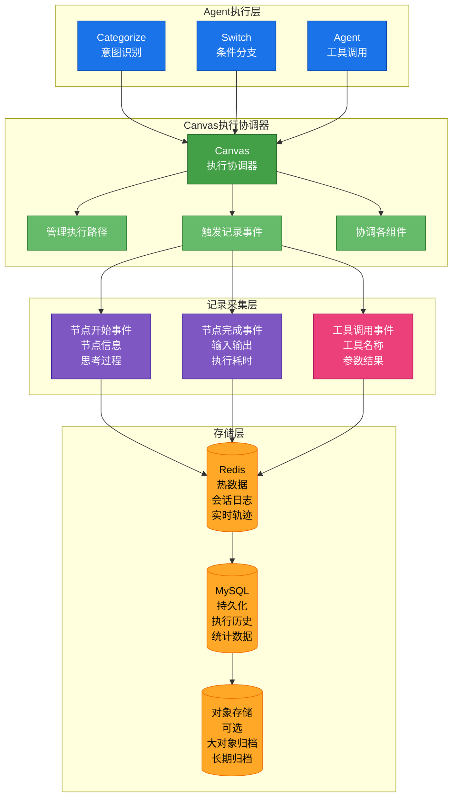

### 2.2 数据流设计

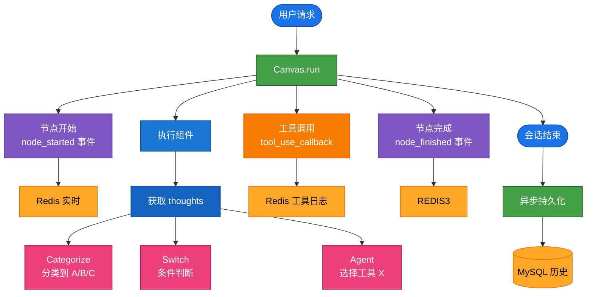

---

## 三、数据模型设计

### 3.1 核心实体

#### 3.1.1 执行会话 (Execution Session)

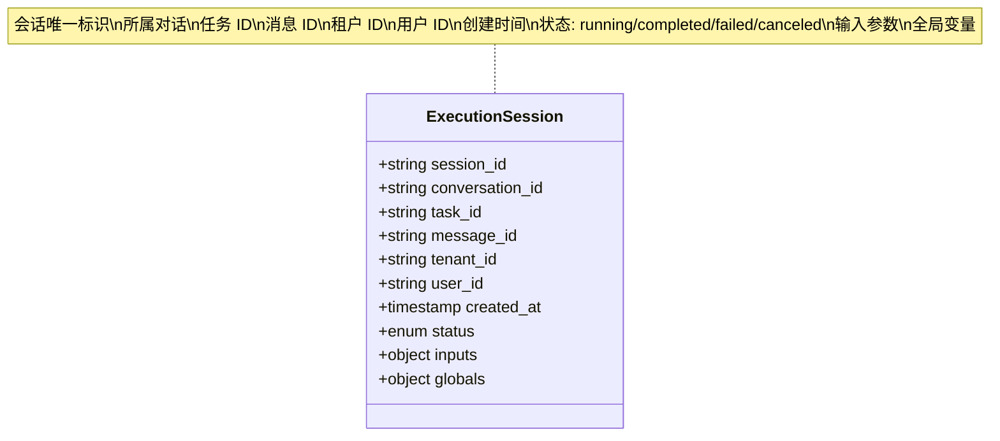

#### 3.1.2 节点执行记录 (Node Execution)

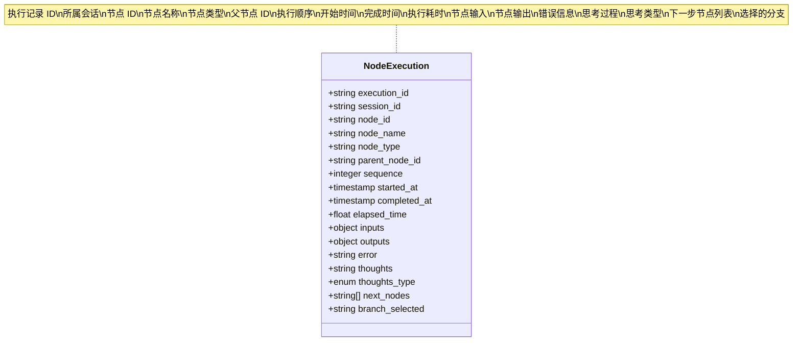

#### 3.1.3 工具调用记录 (Tool Call)

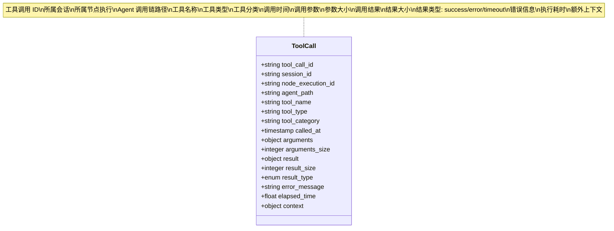

### 3.2 数据关系

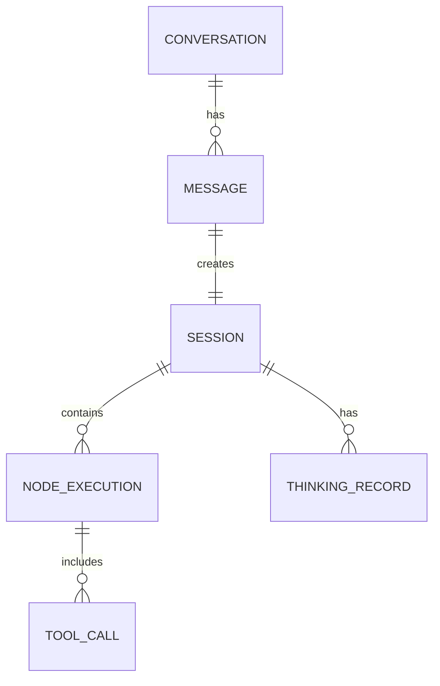

---

## 四、记录策略

### 4.1 分级记录策略

根据重要性和频率，采用分级记录：

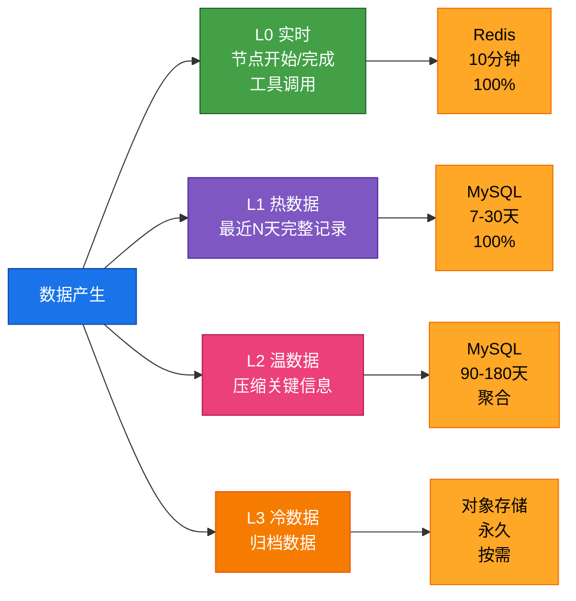

| 级别 | 记录内容 | 存储位置 | 保留时间 | 记录频率 |
|------|----------|----------|----------|----------|
| **L0 - 实时** | 节点开始/完成、工具调用 | Redis | 10分钟 | 100% |
| **L1 - 热数据** | 最近N天的完整记录 | MySQL | 7-30天 | 100% |
| **L2 - 温数据** | 压缩后的关键信息 | MySQL | 90-180天 | 聚合 |
| **L3 - 冷数据** | 归档数据 | 对象存储 | 永久 | 按需 |

### 4.2 记录时机

```mermaid
sequenceDiagram
    participant Comp as 组件
    participant Canvas as Canvas
    participant Redis as Redis
    participant CB as Callback

    Comp->>Canvas: 节点开始
    Canvas->>Redis: node_started 事件<br/>包含 thoughts
    Note over Redis 实时存储

    Comp->>Canvas: 工具调用
    Canvas->>CB: tool_use_callback
    CB->>Redis: 工具调用日志
    Note over Redis 实时存储

    Comp->>Canvas: 节点完成
    Canvas->>Redis: node_finished 事件
    Note over Redis 实时存储
```

### 4.3 内容采样策略

对于大对象（如长文本、图片等），采用采样策略：

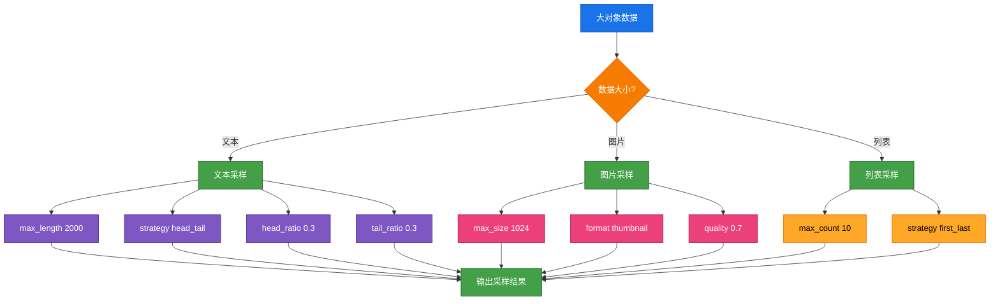

---

## 五、存储方案

### 5.1 Redis 存储（实时数据）

```mermaid
flowchart LR
    KEY[Key 设计] --> K1[session<br/>{task_id}-session]
    KEY --> K2[logs<br/>{task_id}-{message_id}-logs]
    KEY --> K3[trace<br/>{task_id}-{message_id}-trace]
    KEY --> K4[thinking<br/>{task_id}-{message_id}-thinking]

    K1 --> T1[Hash<br/>TTL 600s]
    K2 --> T2[List<br/>TTL 600s]
    K3 --> T3[Stream<br/>TTL 600s]
    K4 --> T4[Hash<br/>TTL 600s]

    T1 --> F1[status<br/>started_at<br/>current_node]
    T2 --> F2[event_type<br/>timestamp<br/>data]
    T3 --> F3[node_id<br/>event<br/>timestamp]
    T4 --> F4[thoughts<br/>timestamp]

    style KEY fill:#1a73e8,stroke:#0d47a1,color:#ffffff
    style K1 fill:#43a047,stroke:#1b5e20,color:#ffffff
    style K2 fill:#43a047,stroke:#1b5e20,color:#ffffff
    style K3 fill:#43a047,stroke:#1b5e20,color:#ffffff
    style K4 fill:#43a047,stroke:#1b5e20,color:#ffffff
    style T1 fill:#7e57c2,stroke:#4527a0,color:#ffffff
    style T2 fill:#7e57c2,stroke:#4527a0,color:#ffffff
    style T3 fill:#7e57c2,stroke:#4527a0,color:#ffffff
    style T4 fill:#7e57c2,stroke:#4527a0,color:#ffffff
    style F1 fill:#ec407a,stroke:#ad1457,color:#ffffff
    style F2 fill:#ec407a,stroke:#ad1457,color:#ffffff
    style F3 fill:#ec407a,stroke:#ad1457,color:#ffffff
    style F4 fill:#ec407a,stroke:#ad1457,color:#ffffff
```

### 5.2 MySQL 存储（持久化）

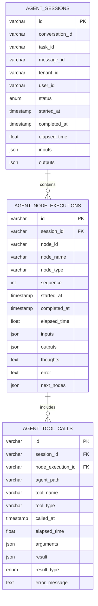

### 5.3 归档策略

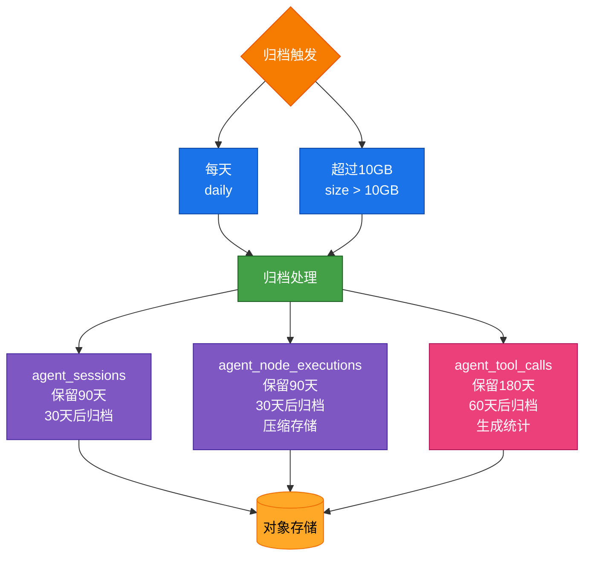

---

## 六、查询与展示方案

### 6.1 查询 API 设计

```mermaid
flowchart TB
    API[查询 API] --> GET1[GET /api/sessions/{session_id}<br/>获取会话详情]
    API --> GET2[GET /api/sessions/{session_id}/trace<br/>获取执行轨迹]
    API --> GET3[GET /api/sessions/{session_id}/tools<br/>获取工具调用]
    API --> GET4[GET /api/sessions/{session_id}/thoughts<br/>获取思考记录]

    GET1 --> R1[session_info<br/>nodes<br/>tool_calls<br/>timeline]
    GET2 --> R2[path<br/>nodes<br/>branches]
    GET3 --> R3[tool_calls<br/>summary]
    GET4 --> R4[thoughts<br/>timeline]

    style API fill:#1a73e8,stroke:#0d47a1,color:#ffffff
    style GET1 fill:#43a047,stroke:#1b5e20,color:#ffffff
    style GET2 fill:#43a047,stroke:#1b5e20,color:#ffffff
    style GET3 fill:#43a047,stroke:#1b5e20,color:#ffffff
    style GET4 fill:#43a047,stroke:#1b5e20,color:#ffffff
    style R1 fill:#7e57c2,stroke:#4527a0,color:#ffffff
    style R2 fill:#7e57c2,stroke:#4527a0,color:#ffffff
    style R3 fill:#ec407a,stroke:#ad1457,color:#ffffff
    style R4 fill:#ffa726,stroke:#ef6c00,color:#000000
```

### 6.2 前端展示设计

```mermaid
flowchart TB
    subgraph 执行时间轴
        START([开始]) --> CAT[分类]
        CAT --> AGT[Agent]
        AGT --> GEN[生成]
        GEN --> END([结束])

        START -.->|思考| T1[选择分支]
        CAT -.->|思考| T2[分类到 A类]
        AGT -.->|工具调用| TOOL[调用搜索 API]
        GEN -.->|思考| T3[生成回答]
        END -.->|完成| TIME[耗时 2.3s]
    end

    subgraph 工具调用详情
        TOOL1[🔍 search_knowledge_base]
        TOOL1 --> P1[参数<br/>query: 如何使用 RAGFlow<br/>top_k: 5]
        P1 --> R1[结果<br/>✓ 找到 3 个相关文档<br/>- RAGFlow 快速入门.pdf 0.92<br/>- Agent 开发指南.md 0.87<br/>- 常见问题 FAQ.md 0.75]
        R1 --> E1[耗时 1.2s]

        TOOL2[🔍 search_internet]
        TOOL2 --> P2[参数<br/>query: 最新 AI 发展趋势]
        P2 --> R2[结果<br/>✗ 超时 10s]
    end

    style START fill:#1a73e8,stroke:#0d47a1,color:#ffffff
    style CAT fill:#43a047,stroke:#1b5e20,color:#ffffff
    style AGT fill:#7e57c2,stroke:#4527a0,color:#ffffff
    style GEN fill:#ec407a,stroke:#ad1457,color:#ffffff
    style END fill:#43a047,stroke:#1b5e20,color:#ffffff
    style T1 fill:#ffa726,stroke:#ef6c00,color:#000000
    style T2 fill:#ffa726,stroke:#ef6c00,color:#000000
    style TOOL fill:#ffa726,stroke:#ef6c00,color:#000000
    style T3 fill:#ffa726,stroke:#ef6c00,color:#000000
    style TIME fill:#ffa726,stroke:#ef6c00,color:#000000
    style TOOL1 fill:#1a73e8,stroke:#0d47a1,color:#ffffff
    style TOOL2 fill:#1a73e8,stroke:#0d47a1,color:#ffffff
    style P1 fill:#43a047,stroke:#1b5e20,color:#ffffff
    style P2 fill:#43a047,stroke:#1b5e20,color:#ffffff
    style R1 fill:#7e57c2,stroke:#4527a0,color:#ffffff
    style R2 fill:#ec407a,stroke:#ad1457,color:#ffffff
    style E1 fill:#ffa726,stroke:#ef6c00,color:#000000
```

### 6.3 可视化选项

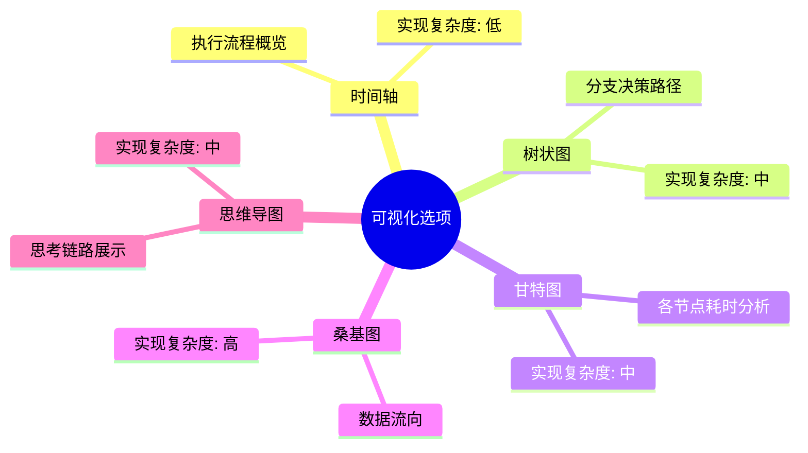

---

## 七、性能与扩展性

### 7.1 性能优化策略

```mermaid
flowchart TB
    PERF[性能优化] --> ASYNC[异步写入]
    PERF --> COMP[数据压缩]
    PERF --> CACHE[缓存策略]
    PERF --> IDX[索引优化]

    ASYNC --> A1[消息队列缓冲]
    ASYNC --> A2[批量写入数据库]
    ASYNC --> A3[Redis 先写<br/>异步同步 MySQL]

    COMP --> C1[gzip 压缩 JSON]
    COMP --> C2[大文本单独压缩]
    COMP --> C3[归档时压缩]

    CACHE --> CA1[热点数据缓存]
    CACHE --> CA2[统计数据预计算]
    CACHE --> CA3[查询结果缓存]

    IDX --> I1[租户 ID 分区]
    IDX --> I2[时间范围分区]
    IDX --> I3[复合索引优化]

    style PERF fill:#1a73e8,stroke:#0d47a1,color:#ffffff
    style ASYNC fill:#43a047,stroke:#1b5e20,color:#ffffff
    style COMP fill:#7e57c2,stroke:#4527a0,color:#ffffff
    style CACHE fill:#ec407a,stroke:#ad1457,color:#ffffff
    style IDX fill:#ffa726,stroke:#ef6c00,color:#000000
    style A1 fill:#66bb6a,stroke:#2e7d32,color:#ffffff
    style A2 fill:#66bb6a,stroke:#2e7d32,color:#ffffff
    style A3 fill:#66bb6a,stroke:#2e7d32,color:#ffffff
    style C1 fill:#9575cd,stroke:#5e35b1,color:#ffffff
    style C2 fill:#9575cd,stroke:#5e35b1,color:#ffffff
    style C3 fill:#9575cd,stroke:#5e35b1,color:#ffffff
    style CA1 fill:#f06292,stroke:#c2185b,color:#ffffff
    style CA2 fill:#f06292,stroke:#c2185b,color:#ffffff
    style CA3 fill:#f06292,stroke:#c2185b,color:#ffffff
    style I1 fill:#ffcc80,stroke:#ef6c00,color:#000000
    style I2 fill:#ffcc80,stroke:#ef6c00,color:#000000
    style I3 fill:#ffcc80,stroke:#ef6c00,color:#000000
```

### 7.2 扩展性设计

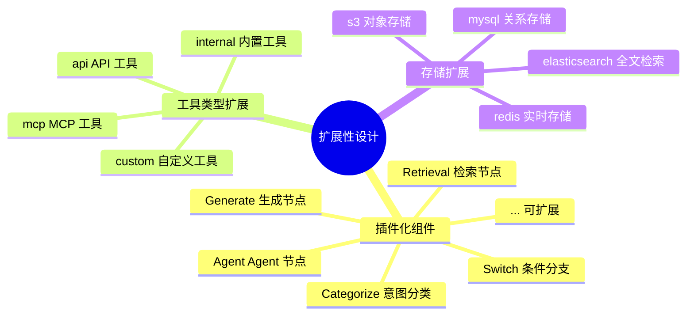

---

## 八、安全与隐私

### 8.1 数据安全

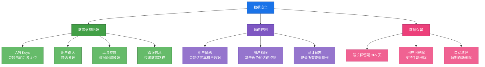

### 8.2 合规性考虑

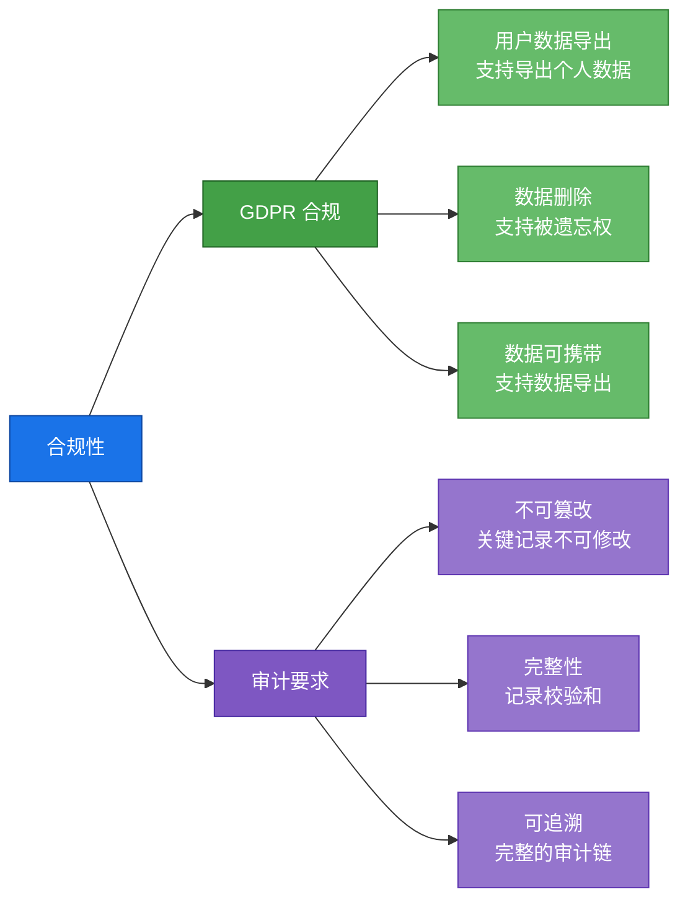

---

## 九、实施路线图

### 9.1 分阶段实施

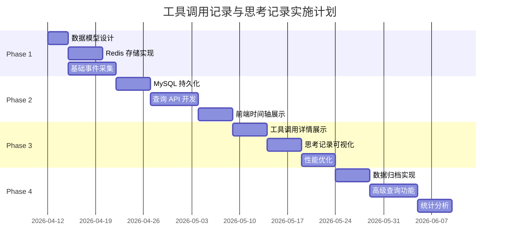

### 9.2 里程碑

| 阶段 | 交付物 | 验收标准 |
|------|--------|----------|
| **Phase 1** | 基础记录功能 | 能记录节点执行和工具调用 |
| **Phase 2** | 持久化和查询 | 数据持久化，提供查询 API |
| **Phase 3** | 可视化展示 | 前端展示执行轨迹 |
| **Phase 4** | 高级功能 | 归档、统计、分析 |

---

## 十、附录

### 10.1 术语表

| 术语 | 说明 |
|------|------|
| Session | 一次完整的 Agent 执行会话 |
| Node Execution | 单个组件节点的执行记录 |
| Tool Call | 工具调用的详细记录 |
| Thoughts | Agent 在决策过程中的思考记录 |
| Trace | 执行轨迹，记录节点间的流转 |

### 10.2 参考资料

- RAGFlow 架构文档
- Agent 组件设计文档
- OpenAI Tool Calling 规范
- LangChain 可观测性实践

---

## 变更记录

| 版本 | 日期 | 作者 | 变更内容 |
|------|------|------|----------|
| 0.1 | 2026-04-12 | RAGFlow Team | 初始版本 |
