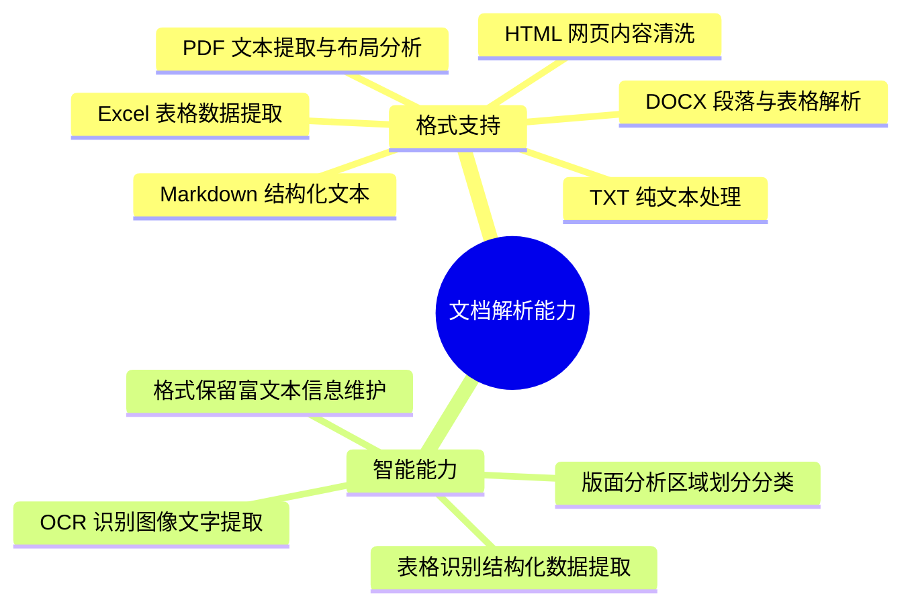
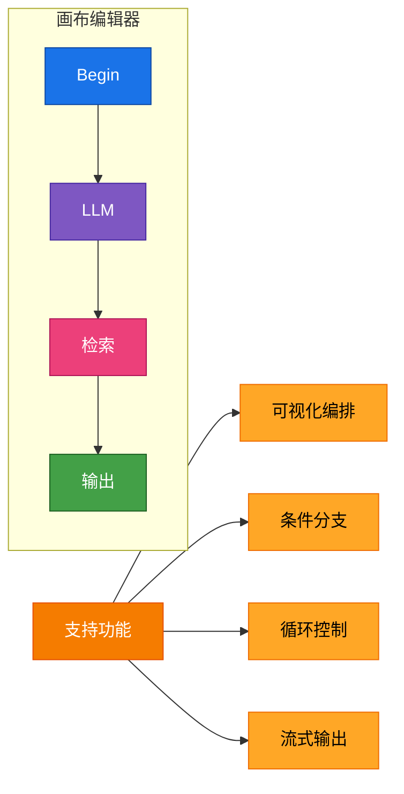
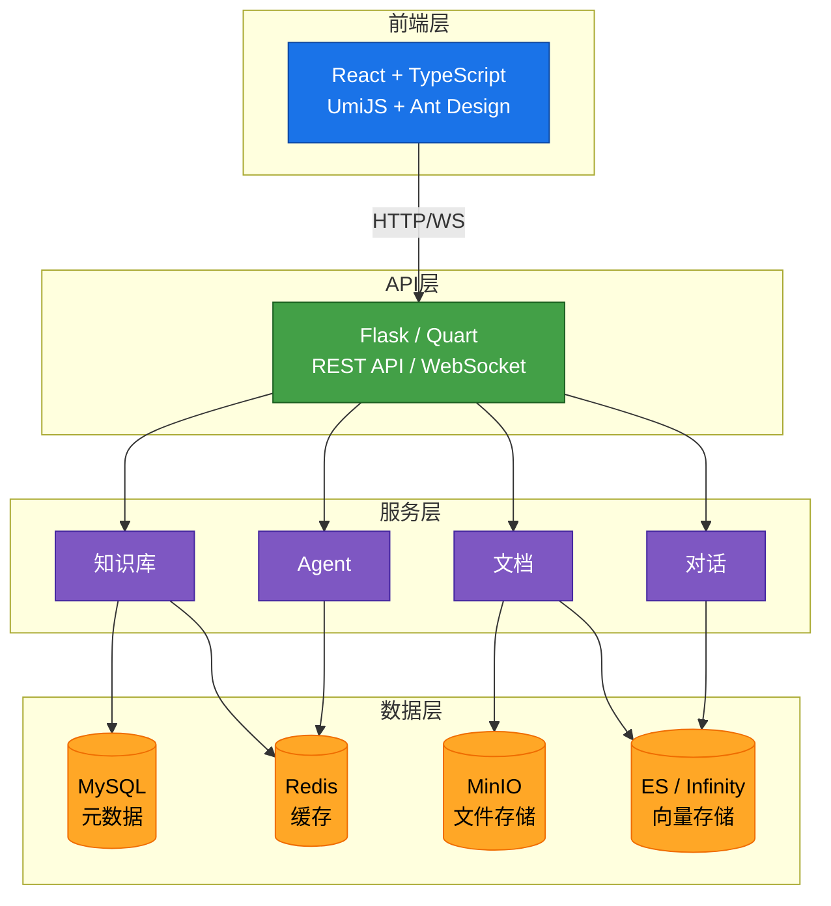
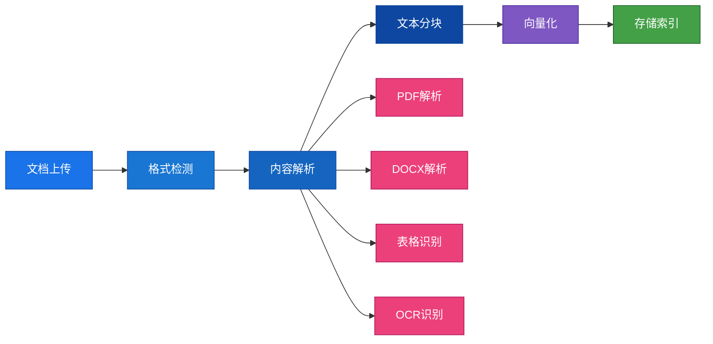
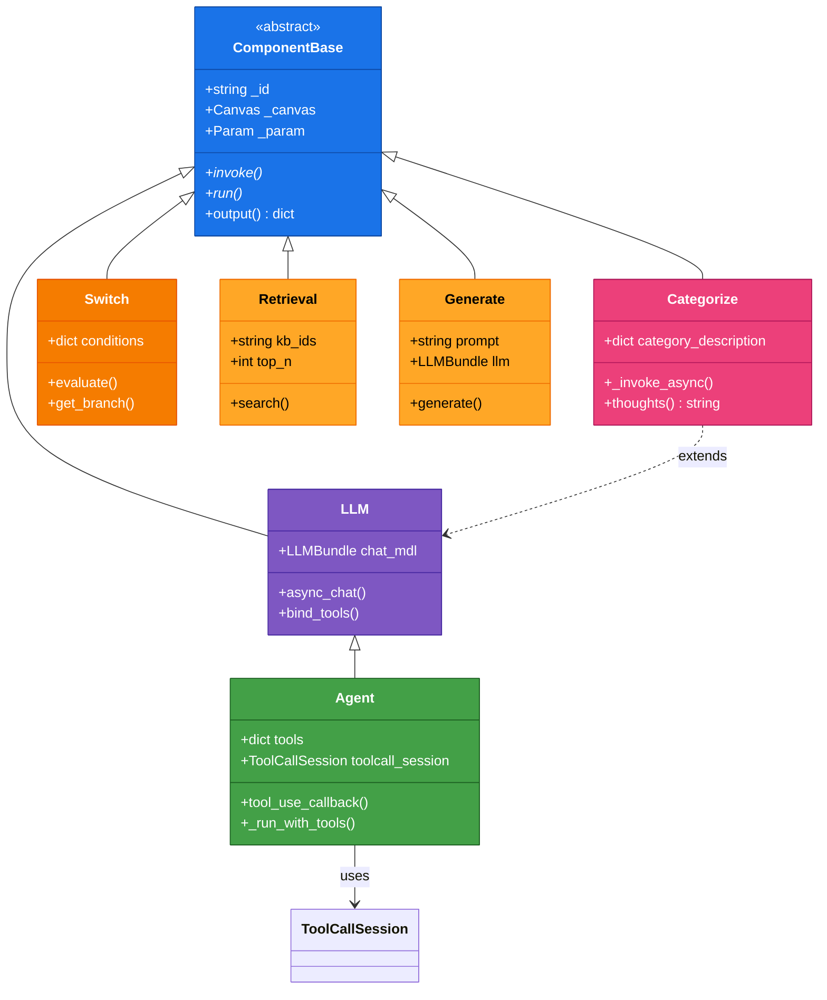
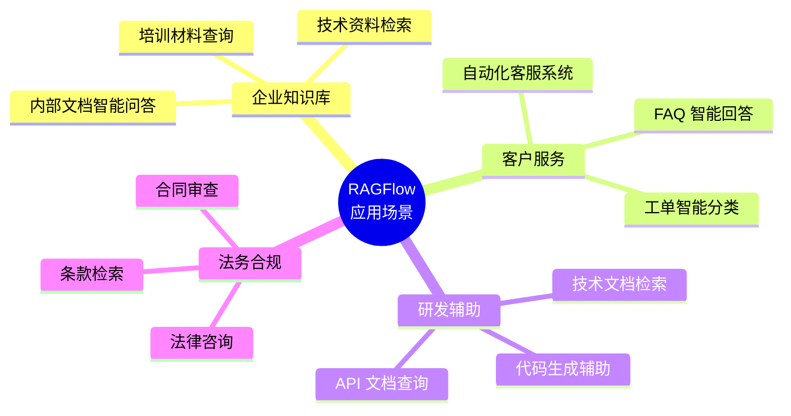

# RAGFlow 项目简介

## 概述

RAGFlow 是一个基于深度文档理解的开源 RAG（Retrieval-Augmented Generation）引擎。它结合了先进的文档解析能力、强大的检索系统和灵活的 LLM 集成，为企业级知识管理和智能问答提供完整解决方案。

## 核心特性

### 1. 深度文档理解



### 2. 灵活的 RAG 管道

可配置的文本处理和检索流程：


### 3. Agent 工作流

可视化画布编排，构建复杂 AI 应用：



### 4. 多模型支持

| 类型 | 支持模型 |
|------|----------|
| **Chat** | OpenAI GPT-4、Anthropic Claude、通义千问、文心一言、智谱 GLM |
| **Embedding** | OpenAI、BAAI bge、Jina |
| **Rerank** | Cohere、BAAI、Jina |
| **OCR** | PaddleOCR、Tesseract |

### 5. 企业级功能

- 多租户支持和数据隔离
- 细粒度权限控制 (RBAC)
- API 密钥管理
- 分布式部署能力

## 技术架构

### 整体架构图



### 技术栈

| 层级 | 技术 |
|------|------|
| **前端** | React、TypeScript、UmiJS、Ant Design、Zustand |
| **后端** | Python 3.10+、Quart、Peewee |
| **数据存储** | MySQL、Redis、Elasticsearch/Infinity、MinIO |
| **LLM** | OpenAI、Anthropic、通义千问、文心一言等 |

## 核心流程

### 文档处理流程



实现文件:
- [`api/apps/document_app.py`](../../api/apps/document_app.py) - 文档上传入口
- [`deepdoc/parser/`](../../deepdoc/parser/) - 内容解析器
- [`rag/flow/chunker/`](../../rag/flow/chunker/) - 文本分块策略
- [`rag/llm/embedding.py`](../../rag/llm/embedding.py) - 向量化

### RAG 问答流程

```mermaid
sequenceDiagram
    participant User as 用户
    participant API as Dialog API
    participant Search as 检索引擎
    participant Rerank as 重排序
    participant LLM as LLM生成

    User->>API: 发送查询
    API->>Search: 检索相关文档
    Search-->>API: 返回候选文档
    API->>Rerank: 重排序优化
    Rerank-->>API: 返回排序结果
    API->>API: 上下文组装
    API->>LLM: 生成答案
    LLM-->>API: 返回答案
    API-->>User: 返回结果

    Note over Search,LLM RAG处理流程

    style User fill:#1a73e8,stroke:#0d47a1,color:#ffffff
    style API fill:#43a047,stroke:#1b5e20,color:#ffffff
    style Search fill:#7e57c2,stroke:#4527a0,color:#ffffff
    style Rerank fill:#ec407a,stroke:#ad1457,color:#ffffff
    style LLM fill:#ffa726,stroke:#ef6c00,color:#000000
```

实现文件:
- [`api/apps/dialog_app.py`](../../api/apps/dialog_app.py) - 对话入口
- [`rag/nlp/search.py`](../../rag/nlp/search.py) - 检索引擎
- [`rag/llm/rerank.py`](../../rag/llm/rerank.py) - 重排序
- [`rag/llm/chat_model.py`](../../rag/llm/chat_model.py) - LLM 生成

### Agent 执行流程

```mermaid
stateDiagram-v2
    [*] --> 画布定义: 用户创建
    画布定义 --> 组件加载: 开始执行
    组件加载 --> 变量解析: 加载完成
    变量解析 --> 执行编排: 变量就绪
    执行编排 --> 执行编排: 下一个节点
    执行编排 --> 事件推送: 节点完成
    事件推送 --> 执行编排: 继续
    执行编排 --> 结果输出: 执行完成
    结果输出 --> [*]: 结束

    note right of 执行编排
        支持条件分支、循环
        并行执行等复杂流程
    end note

    note right of 事件推送
        实时推送执行状态
        工具调用记录
        思考过程输出
    end note

    classDef primary fill:#1a73e8,stroke:#0d47a1,color:#ffffff
    classDef success fill:#43a047,stroke:#1b5e20,color:#ffffff
    classDef warning fill:#ffa726,stroke:#ef6c00,color:#000000
    classDef info fill:#7e57c2,stroke:#4527a0,color:#ffffff

    class 画布定义,组件加载,变量解析 primary
    class 执行编排,事件推送 info
    class 结果输出 success
```

实现文件:
- [`agent/canvas.py`](../../agent/canvas.py) - Canvas 执行引擎
- [`agent/component/base.py`](../../agent/component/base.py) - 组件基类
- [`agent/component/__init__.py`](../../agent/component/__init__.py) - 组件动态加载

### Agent 组件架构



## 应用场景



## 许可证

Apache License 2.0

## 参考资源

- 官网：https://ragflow.io
- GitHub：https://github.com/infiniflow/ragflow
- 文档：https://ragflow.io/docs
