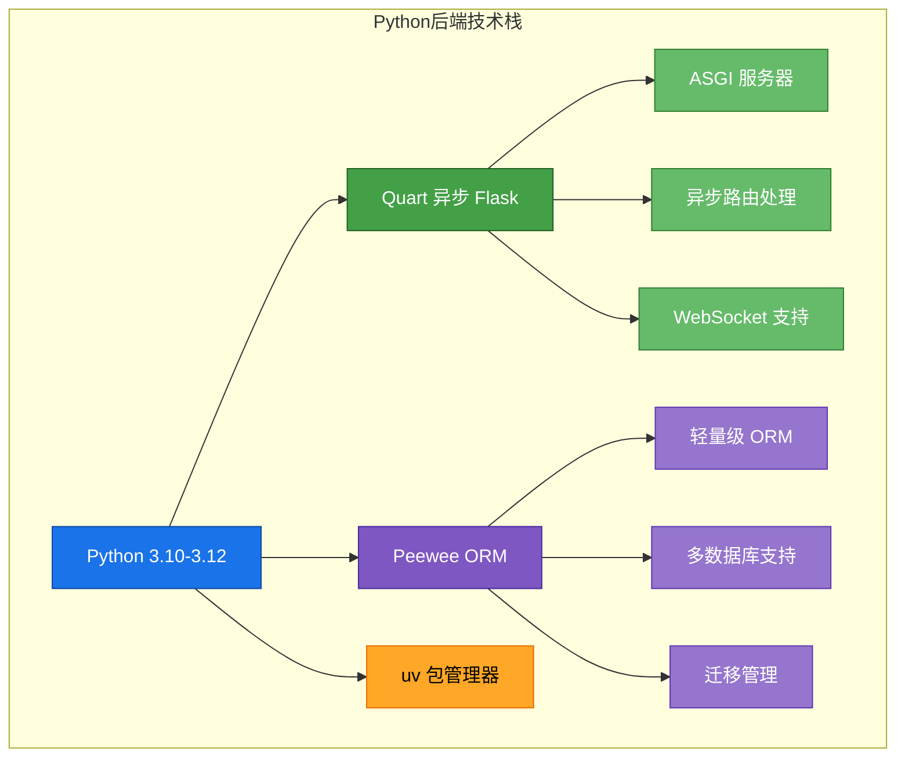
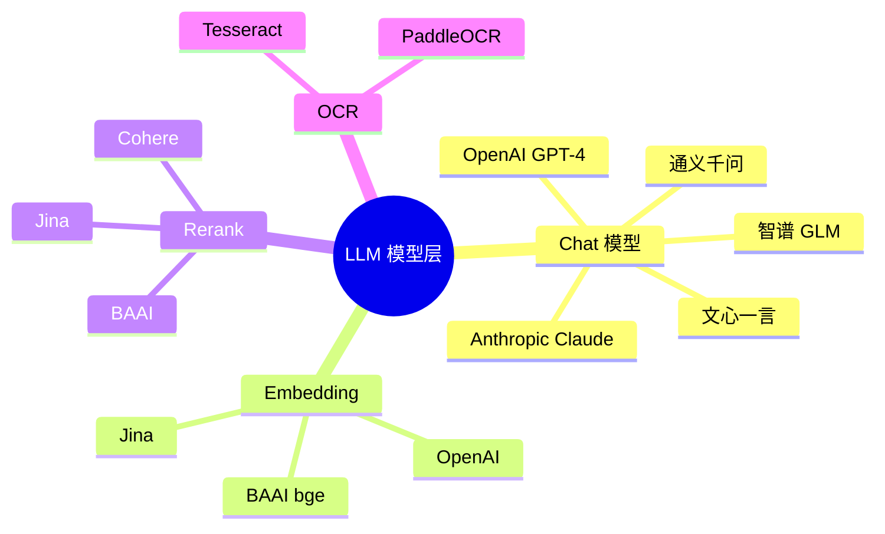
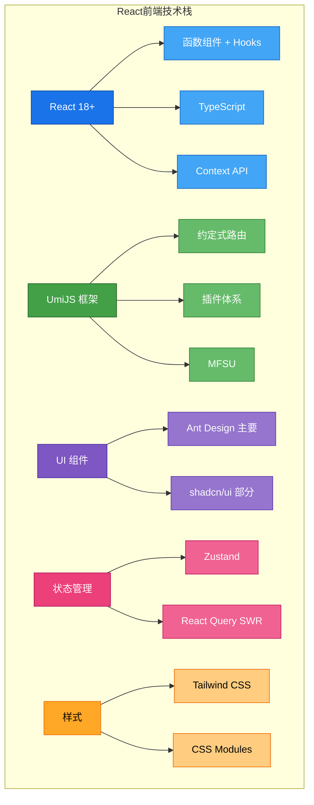
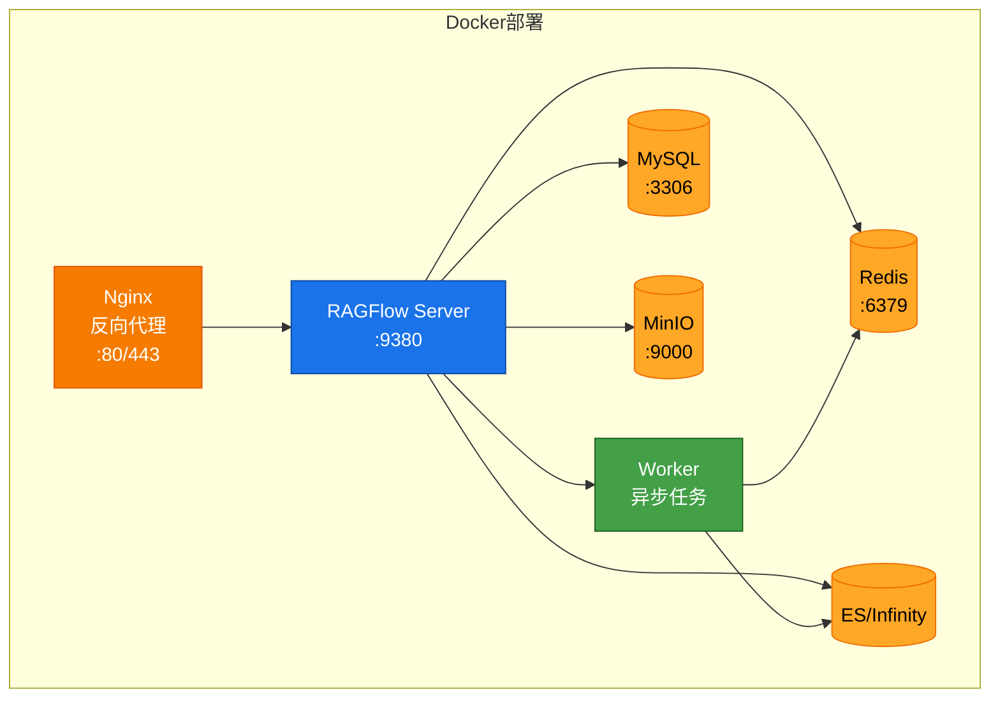
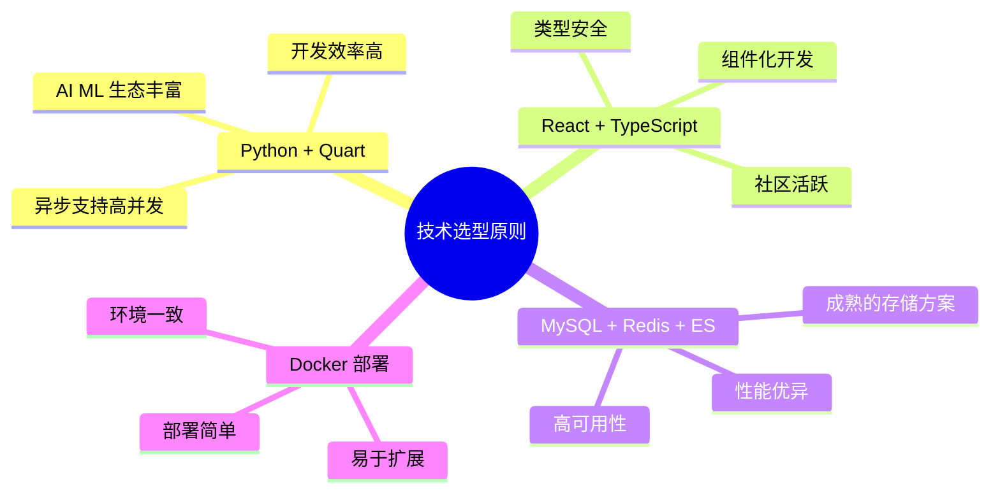

# RAGFlow 技术栈

## 概述

RAGFlow 采用现代化的技术栈，支持快速开发和灵活部署。

## 后端技术栈

### 数据存储

| 组件 | 技术 | 用途 |
|------|------|------|
| **关系数据库** | MySQL / PostgreSQL | 用户数据、元数据、配置 |
| **缓存** | Redis | 会话、缓存、任务队列、分布式锁 |
| **向量存储** | Elasticsearch / Infinity | 向量存储、全文检索 |
| **对象存储** | MinIO / S3 | 文件存储、解析结果 |

### LLM 集成

## 前端技术栈

## 部署技术栈

### 容器化部署

## 开发工具

### 后端开发工具

| 工具 | 用途 |
|------|------|
| **uv** | 快速 Python 包管理器 |
| **ruff** | Linter 和 Formatter |
| **pytest** | 测试框架 |
| **mypy** | 类型检查 |

### 前端开发工具

| 工具 | 用途 |
|------|------|
| **npm/pnpm** | 包管理器 |
| **ESLint** | 代码检查 |
| **Prettier** | 代码格式化 |
| **Jest** | 测试框架 |
| **Vite** | 构建工具 |

## 技术选型原则

## 相关文件

- [`pyproject.toml`](../../pyproject.toml) - Python 依赖配置
- [`web/package.json`](../../web/package.json) - 前端依赖配置
- [`docker/Dockerfile`](../../docker/Dockerfile) - 镜像构建配置
- [`docker/docker-compose.yml`](../../docker/docker-compose.yml) - 服务编排配置
