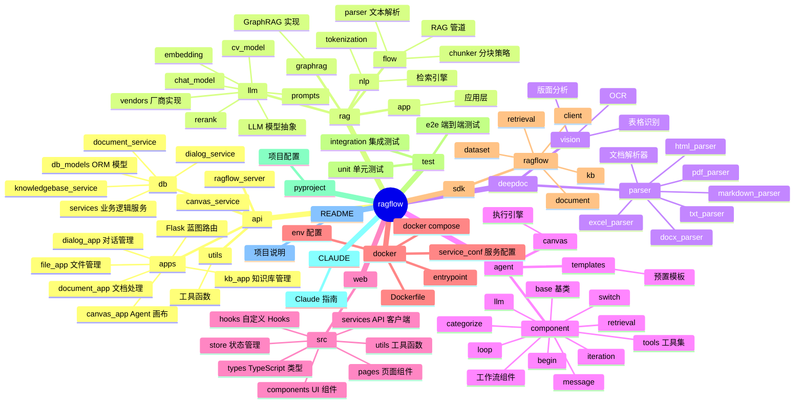
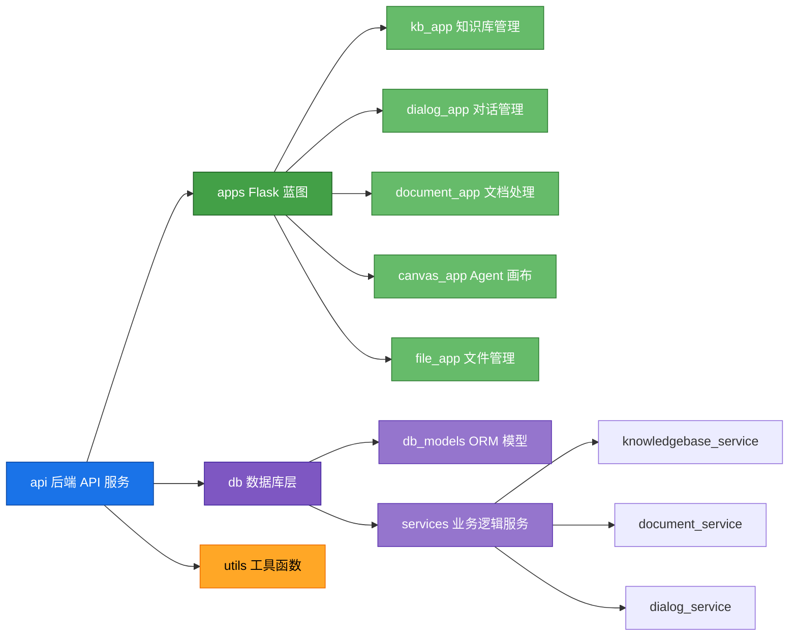
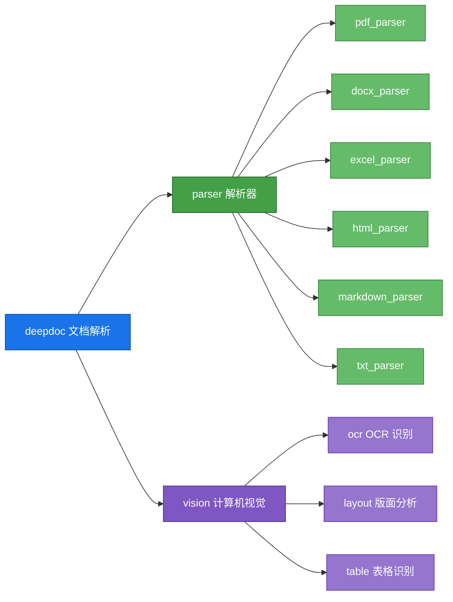
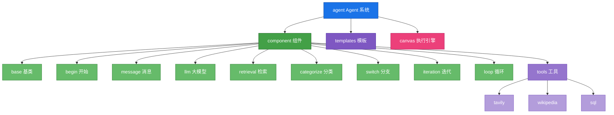

# RAGFlow 目录结构

## 概述

RAGFlow 采用模块化的目录结构，各司其职，便于维护和扩展。

## 目录结构概览

## 各目录职责说明

### `api/` - 后端 API 服务

| 子目录 | 职责 |
|--------|------|
| `apps/` | Flask 蓝图，定义 API 路由和端点 |
| `db/` | 数据库模型和服务层 |
| `utils/` | 工具函数和辅助类 |

### `rag/` - RAG 核心引擎

```mermaid
flowchart TB
    RAG[rag RAG 核心引擎] --> LLM[llm LLM 模型抽象]
    RAG --> FLOW[flow RAG 管道]
    RAG --> NLP[nlp NLP 工具]
    RAG --> GRAPHRAG[graphrag GraphRAG]
    RAG --> APP[app 应用层]

    LLM --> CHAT[chat_model Chat 模型]
    LLM --> EMB[embedding Embedding]
    LLM --> RERANK[rerank Rerank]
    LLM --> CV[cv_model OCR]
    LLM --> PROMPT[prompts Prompt 模板]
    LLM --> VENDORS[vendors 厂商实现]

    FLOW --> CHUNKER[chunker 分块策略]
    FLOW --> PARSER[parser 文本解析]
    FLOW --> PRE[preprocessing 预处理]

    NLP --> SEARCH[search 检索引擎]
    NLP --> TOKEN[tokenization 分词]
    NLP --> UTILS[rag_utils 工具函数]

    style RAG fill:#1a73e8,stroke:#0d47a1,color:#ffffff
    style LLM fill:#43a047,stroke:#1b5e20,color:#ffffff
    style FLOW fill:#43a047,stroke:#1b5e20,color:#ffffff
    style NLP fill:#43a047,stroke:#1b5e20,color:#ffffff
    style GRAPHRAG fill:#ec407a,stroke:#ad1457,color:#ffffff
    style APP fill:#ec407a,stroke:#ad1457,color:#ffffff
    style CHAT fill:#66bb6a,stroke:#2e7d32,color:#ffffff
    style EMB fill:#66bb6a,stroke:#2e7d32,color:#ffffff
    style RERANK fill:#66bb6a,stroke:#2e7d32,color:#ffffff
    style CV fill:#66bb6a,stroke:#2e7d32,color:#ffffff
    style PROMPT fill:#66bb6a,stroke:#2e7d32,color:#ffffff
    style VENDORS fill:#66bb6a,stroke:#2e7d32,color:#ffffff
    style CHUNKER fill:#7e57c2,stroke:#4527a0,color:#ffffff
    style PARSER fill:#7e57c2,stroke:#4527a0,color:#ffffff
    style PRE fill:#7e57c2,stroke:#4527a0,color:#ffffff
    style SEARCH fill:#9575cd,stroke:#5e35b1,color:#ffffff
    style TOKEN fill:#9575cd,stroke:#5e35b1,color:#ffffff
    style UTILS fill:#9575cd,stroke:#5e35b1,color:#ffffff
```

| 子目录 | 职责 |
|--------|------|
| `llm/` | LLM 模型抽象和厂商适配 |
| `flow/` | RAG 管道：分块、解析、预处理 |
| `nlp/` | NLP 工具：检索、分词、工具函数 |
| `graphrag/` | GraphRAG 知识图谱实现 |
| `app/` | 应用层：知识库、对话、检索 |

### `deepdoc/` - 文档解析

| 子目录 | 职责 |
|--------|------|
| `parser/` | 各格式解析器实现 |
| `vision/` | OCR、版面分析、表格识别 |

### `agent/` - Agent 系统

| 子目录 | 职责 |
|--------|------|
| `component/` | 工作流组件实现 |
| `templates/` | 预置工作流模板 |

### `web/` - 前端应用

```mermaid
flowchart TB
    WEB[web React 前端] --> PAGES[src/pages 页面]
    WEB --> COMP[src/components 组件]
    WEB --> SVC[src/services API]
    WEB --> STORE[src/store 状态]
    WEB --> HOOKS[src/hooks Hooks]
    WEB --> UTILS[src/utils 工具]
    WEB --> TYPES[src/types 类型]

    PAGES --> CHAT[chat 聊天]
    PAGES --> KB[kb 知识库]
    PAGES --> CANVAS[canvas 画布]
    PAGES --> SETTINGS[settings 设置]

    COMP --> KB_C[kb 组件]
    COMP --> CHAT_C[chat 组件]
    COMP --> CANVAS_C[canvas 组件]
    COMP --> COMMON[common 通用]

    style WEB fill:#1a73e8,stroke:#0d47a1,color:#ffffff
    style PAGES fill:#43a047,stroke:#1b5e20,color:#ffffff
    style COMP fill:#43a047,stroke:#1b5e20,color:#ffffff
    style SVC fill:#7e57c2,stroke:#4527a0,color:#ffffff
    style STORE fill:#ec407a,stroke:#ad1457,color:#ffffff
    style HOOKS fill:#ffa726,stroke:#ef6c00,color:#000000
    style UTILS fill:#ffa726,stroke:#ef6c00,color:#000000
    style TYPES fill:#ffa726,stroke:#ef6c00,color:#000000
    style CHAT fill:#66bb6a,stroke:#2e7d32,color:#ffffff
    style KB fill:#66bb6a,stroke:#2e7d32,color:#ffffff
    style CANVAS fill:#66bb6a,stroke:#2e7d32,color:#ffffff
    style SETTINGS fill:#66bb6a,stroke:#2e7d32,color:#ffffff
    style KB_C fill:#9575cd,stroke:#5e35b1,color:#ffffff
    style CHAT_C fill:#9575cd,stroke:#5e35b1,color:#ffffff
    style CANVAS_C fill:#9575cd,stroke:#5e35b1,color:#ffffff
    style COMMON fill:#9575cd,stroke:#5e35b1,color:#ffffff
```

| 子目录 | 职责 |
|--------|------|
| `src/pages/` | 页面组件 |
| `src/components/` | UI 组件库 |
| `src/services/` | API 客户端 |
| `src/store/` | 状态管理 |

### `docker/` - 部署配置

Docker 容器化部署配置。

### `sdk/` - Python SDK

Python SDK，支持外部程序调用 RAGFlow。

## 相关文件

- [`api/ragflow_server.py`](../../api/ragflow_server.py) - 服务器入口
- [`api/apps/__init__.py`](../../api/apps/__init__.py) - 蓝图注册
- [`agent/canvas.py`](../../agent/canvas.py) - 执行引擎
- [`docker/docker-compose.yml`](../../docker/docker-compose.yml) - 服务编排
