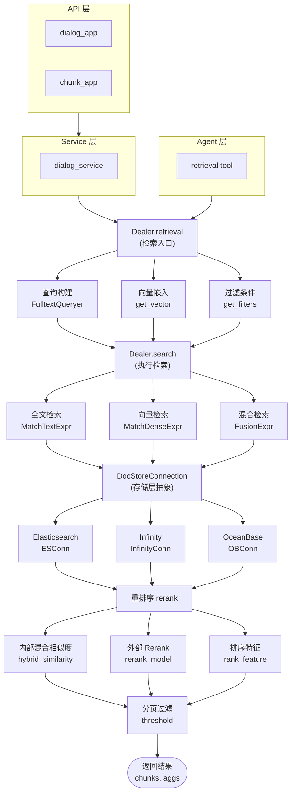

# 检索系统总览

> **模块路径**: `rag/nlp/search.py`, `rag/nlp/query.py`, `common/doc_store/`
> **核心类**: `Dealer`, `FulltextQueryer`, `DocStoreConnection`
> **相关文档**: [007-检索机制调用链详解](../04-RAG引擎/007-检索机制调用链详解.md)

---

## 概述

RAGFlow 的检索系统是一个混合检索引擎，结合了全文检索、向量检索和多种重排序策略，为知识库问答提供高质量的检索结果。

### 核心特性

- **混合检索**: 结合 BM25 全文检索和向量语义检索
- **多路重排序**: 支持内部混合相似度和外部 Rerank 模型
- **智能查询**: 自动分词、关键词权重计算、同义词扩展
- **高级策略**: TOC 目录检索、父子块检索、标签匹配
- **多引擎支持**: Elasticsearch 和 Infinity 双引擎支持

### 系统架构



---

## 模块文档索引

| 文档 | 说明 | 核心内容 |
|------|------|----------|
| [001-核心检索链路](./001-核心检索链路.md) | Dealer 类和检索入口 | `retrieval()`, `Dealer` 类详解 |
| [002-全文查询构建](./002-全文查询构建.md) | FulltextQueryer 类 | `question()`, 查询字段权重 |
| [003-检索执行](./003-检索执行.md) | search 方法详解 | 三种检索路径、融合策略 |
| [004-重排序机制](./004-重排序机制.md) | 重排序详解 | `rerank()`, `rerank_by_model()` |
| [005-高级检索策略](./005-高级检索策略.md) | 高级检索功能 | TOC 检索、父子块检索、引文插入 |
| [006-核心数据结构](./006-核心数据结构.md) | 数据结构定义 | 表达式类、SearchResult |
| [007-文档存储层](./007-文档存储层.md) | 存储层抽象 | DocStoreConnection、引擎适配 |
| [008-配置参数详解](./008-配置参数详解.md) | 配置参数说明 | 检索参数、字段权重 |

---

## 核心类关系

```
┌─────────────────────────────────────────────────────────┐
│                      核心类关系图                        │
├─────────────────────────────────────────────────────────┤
│                                                          │
│  ┌─────────────────┐         uses        ┌────────────┐ │
│  │     Dealer      │◄─────────────────────│ Fulltext  │ │
│  │  (检索代理)     │                      │ Queryer   │ │
│  │                 │──uses──▶  ┌──────────┤ (查询器)  │ │
│  │ - retrieval()   │         │  term_weight│           │ │
│  │ - search()      │         │  synonym   │           │ │
│  │ - rerank()      │         └────────────┘           │ │
│  │ - insert_citations()                            │   │
│  └────────┬────────┘                                  │   │
│           │                                           │   │
│           │ uses                                      │   │
│           ▼                                           │   │
│  ┌─────────────────────────────────────────────┐     │   │
│  │         DocStoreConnection                  │     │   │
│  │         (存储层抽象接口)                     │     │   │
│  │                                             │     │   │
│  │  + search(matchExprs, filters, orderBy)    │     │   │
│  │  + get(doc_id, fields)                     │     │   │
│  │  + insert(doc)                             │     │   │
│  └───────────┬─────────────────────────────────┘     │   │
│              │ implements                             │   │
│      ┌───────┼───────┐                                │   │
│      ▼       ▼       ▼                                │   │
│  ┌───────┐ ┌───────┐ ┌────────┐                       │   │
│  │  ES   │ │Infinity│ │OceanBase│                       │   │
│  │ Conn  │ │ Conn  │ │  Conn  │                       │   │
│  └───────┘ └───────┘ └────────┘                       │   │
│                                                      │   │
│  ┌─────────────────────────────────────────────┐   │   │
│  │           表达式类系统                       │   │   │
│  │                                             │   │   │
│  │  MatchTextExpr   ────▶  全文匹配表达式      │   │   │
│  │  MatchDenseExpr  ────▶  向量匹配表达式      │   │   │
│  │  MatchSparseExpr ────▶  稀疏向量匹配       │   │   │
│  │  FusionExpr      ────▶  融合策略表达式     │   │   │
│  │  OrderByExpr     ────▶  排序表达式         │   │   │
│  └─────────────────────────────────────────────┘   │   │
│                                                      │   │
│  ┌─────────────────────────────────────────────┐   │   │
│  │          SearchResult 数据类                 │   │   │
│  │                                             │   │   │
│  │  - total: int                               │   │   │
│  │  - ids: list[str]                           │   │   │
│  │  - query_vector: list[float]                │   │   │
│  │  - field: dict                              │   │   │
│  │  - highlight: dict                          │   │   │
│  │  - aggregation: list                        │   │   │
│  │  - keywords: list[str]                      │   │   │
│  └─────────────────────────────────────────────┘   │   │
└────────────────────────────────────────────────────┘
```

---

## 检索流程概览

```
用户查询
   │
   ▼
┌──────────────────────────────────────────────────────────┐
│ 1. 查询预处理                                             │
│    - 分词 (rag_tokenizer)                                │
│    - 词权重计算 (term_weight)                            │
│    - 同义词扩展 (synonym)                                │
└──────────────────────┬───────────────────────────────────┘
                       │
                       ▼
┌──────────────────────────────────────────────────────────┐
│ 2. 查询构建                                               │
│    - 全文查询: FulltextQueryer.question()               │
│      → MatchTextExpr (字段+权重+查询串)                  │
│    - 向量查询: get_vector()                             │
│      → MatchDenseExpr (向量列+嵌入数据+距离类型)         │
│    - 融合策略: FusionExpr("weighted_sum", ...)          │
└──────────────────────┬───────────────────────────────────┘
                       │
                       ▼
┌──────────────────────────────────────────────────────────┐
│ 3. 存储层检索                                            │
│    - DocStoreConnection.search()                        │
│    - ES/Infinity 执行混合检索                            │
│    - 返回 SearchResult (候选结果)                        │
└──────────────────────┬───────────────────────────────────┘
                       │
                       ▼
┌──────────────────────────────────────────────────────────┐
│ 4. 重排序                                                 │
│    路由选择:                                              │
│    ├─ 有 rerank_mdl → rerank_by_model()                  │
│    ├─ Infinity 引擎 → 直接使用 _score                    │
│    └─ ES 引擎 → rerank() (混合相似度)                    │
│                                                          │
│    混合相似度 = tkweight * token_sim + vtweight * vector_sim│
└──────────────────────┬───────────────────────────────────┘
                       │
                       ▼
┌──────────────────────────────────────────────────────────┐
│ 5. 后处理                                                 │
│    - 排序特征增强 (PageRank + 标签)                       │
│    - 相似度阈值过滤                                       │
│    - 分页提取                                             │
│    - 聚合统计 (按文档分组计数)                            │
└──────────────────────┬───────────────────────────────────┘
                       │
                       ▼
┌──────────────────────────────────────────────────────────┐
│ 6. 返回结果                                               │
│    {                                                      │
│      "total": 总数,                                       │
│      "chunks": [{chunk_id, content, similarity, ...}],   │
│      "doc_aggs": [{doc_name, count}]                     │
│    }                                                      │
└──────────────────────────────────────────────────────────┘
```

---

## 核心文件清单

| 文件路径 | 核心类/函数 | 说明 |
|----------|------------|------|
| `rag/nlp/search.py` | `Dealer` | 检索代理主类 |
| `rag/nlp/search.py:542` | `Dealer.retrieval()` | 检索主入口 |
| `rag/nlp/search.py:168` | `Dealer.search()` | 底层搜索执行 |
| `rag/nlp/search.py:437` | `Dealer.rerank()` | 内部混合重排序 |
| `rag/nlp/search.py:494` | `Dealer.rerank_by_model()` | 模型重排序 |
| `rag/nlp/search.py:299` | `Dealer.insert_citations()` | 引文插入 |
| `rag/nlp/search.py:882` | `Dealer.retrieval_by_toc()` | TOC 目录检索 |
| `rag/nlp/search.py:965` | `Dealer.retrieval_by_children()` | 父子块检索 |
| `rag/nlp/query.py` | `FulltextQueryer` | 全文查询构建器 |
| `rag/nlp/query.py:74` | `FulltextQueryer.question()` | 问题查询构建 |
| `rag/nlp/query.py:276` | `FulltextQueryer.hybrid_similarity()` | 混合相似度计算 |
| `rag/nlp/query.py:311` | `FulltextQueryer.token_similarity()` | 词元相似度 |
| `rag/nlp/rag_tokenizer.py` | - | 分词器 |
| `rag/nlp/term_weight.py` | `Dealer` | 词项权重计算 |
| `rag/nlp/synonym.py` | `Dealer` | 同义词查找 |
| `common/doc_store/doc_store_base.py` | `DocStoreConnection` | 存储层抽象接口 |
| `common/doc_store/doc_store_base.py:56` | `MatchTextExpr` | 全文匹配表达式 |
| `common/doc_store/doc_store_base.py:70` | `MatchDenseExpr` | 向量匹配表达式 |
| `common/doc_store/doc_store_base.py:120` | `FusionExpr` | 融合表达式 |
| `common/doc_store/es_conn_base.py` | `ESConnection` | Elasticsearch 连接 |
| `common/doc_store/infinity_conn_base.py` | `InfinityConnection` | Infinity 连接 |
| `api/db/services/dialog_service.py:1392` | - | 对话检索调用点 |
| `agent/tools/retrieval.py:612` | - | Agent 检索调用点 |

---

## 相关文档

- [007-检索机制调用链详解](../04-RAG引擎/007-检索机制调用链详解.md) — 完整调用链追踪
- [004-检索机制.md](../04-RAG引擎/004-检索机制.md) — 检索机制架构概述
- [005-LLM集成.md](../04-RAG引擎/005-LLM集成.md) — LLM 调用链
