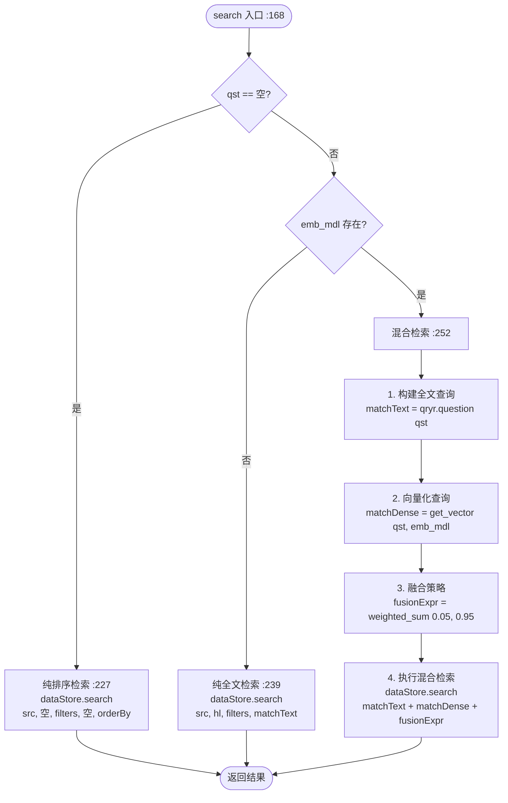
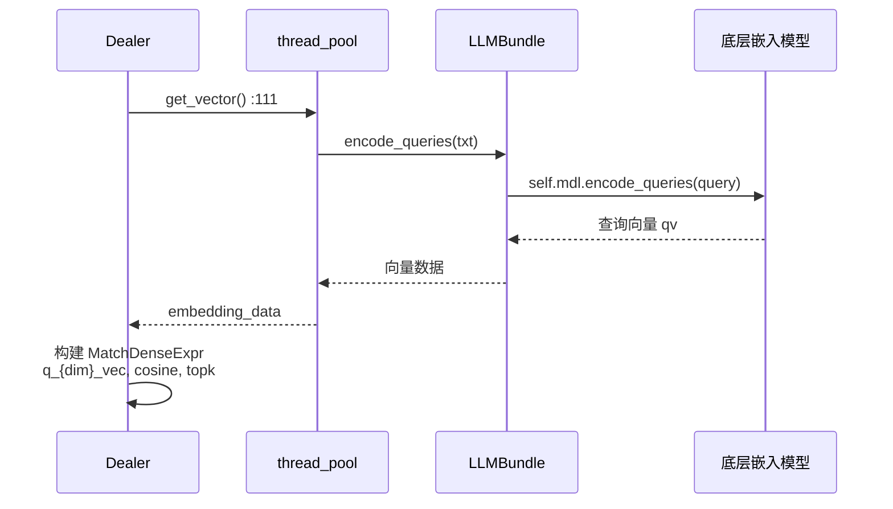

# 核心检索链路

> **核心文件**: `rag/nlp/search.py`
> **核心类**: `Dealer`
> **核心方法**: `retrieval()`, `search()`
> **相关文档**: [000-检索系统总览](./000-检索系统总览.md)

---

## 概述

`Dealer` 类是 RAGFlow 检索系统的核心代理类，负责协调查询构建、向量嵌入、检索执行、重排序等全流程。本文档详细解析 `Dealer` 类的实现和 `retrieval()` 主入口方法。

---

## Dealer 类详解

**文件位置**: `rag/nlp/search.py:59-731`

### 类结构

```python
class Dealer:
    """
    检索代理类

    提供文档检索、重排序、引文插入等核心检索功能。

    Attributes:
        qryr: 全文查询器 (FulltextQueryer)
        dataStore: 文档存储连接 (DocStoreConnection)
    """

    def __init__(self, dataStore: DocStoreConnection):
        """初始化检索代理"""
        self.qryr = query.FulltextQueryer()
        self.dataStore = dataStore
```

### 核心方法清单

| 方法 | 行号 | 说明 |
|------|------|------|
| `__init__()` | 75 | 初始化检索代理 |
| `index_name()` | 56 | 生成索引名 |
| `get_vector()` | 111 | 查询向量化 |
| `get_filters()` | 136 | 提取过滤条件 |
| `search()` | 168 | 执行底层检索 |
| `retrieval()` | 542 | 检索主入口 |
| `rerank()` | 437 | 内部混合重排序 |
| `rerank_by_model()` | 494 | 模型重排序 |
| `insert_citations()` | 299 | 引文插入 |
| `retrieval_by_toc()` | 882 | TOC 目录检索 |
| `retrieval_by_children()` | 965 | 父子块检索 |
| `_rank_feature_scores()` | 409 | 排序特征计算 |

---

## retrieval() 方法详解

**文件位置**: `rag/nlp/search.py:542-731`

### 方法签名

```python
async def retrieval(
    self,
    question,                              # 用户查询文本
    embd_mdl,                              # 嵌入模型 (LLMBundle)
    tenant_ids,                            # 租户 ID（单个或列表）
    kb_ids,                                # 知识库 ID 列表
    page,                                  # 页码
    page_size,                             # 每页大小
    similarity_threshold=0.2,              # 相似度阈值
    vector_similarity_weight=0.3,          # 向量相似度权重
    top=1024,                              # 最大检索结果数
    doc_ids=None,                          # 文档 ID 过滤
    aggs=True,                             # 是否返回聚合
    rerank_mdl=None,                       # 重排序模型
    highlight=False,                       # 是否高亮
    rank_feature=None,                     # 排序特征（默认 PageRank: 10）
):
```

### 参数说明

| 参数 | 类型 | 默认值 | 说明 |
|------|------|--------|------|
| `question` | str | - | 用户查询文本 |
| `embd_mdl` | LLMBundle | - | 嵌入模型，用于查询向量化 |
| `tenant_ids` | str/list | - | 租户 ID，用于数据隔离 |
| `kb_ids` | list[str] | - | 知识库 ID 列表，限定检索范围 |
| `page` | int | - | 页码，从 1 开始 |
| `page_size` | int | - | 每页大小 |
| `similarity_threshold` | float | 0.2 | 相似度过滤阈值 |
| `vector_similarity_weight` | float | 0.3 | 向量相似度在重排序中的权重 |
| `top` | int | 1024 | 向量检索返回的最大结果数 |
| `doc_ids` | list[str] | None | 文档 ID 过滤（可选） |
| `aggs` | bool | True | 是否返回文档聚合统计 |
| `rerank_mdl` | object | None | 外部 Rerank 模型（可选） |
| `highlight` | bool | False | 是否返回高亮文本 |
| `rank_feature` | dict | None | 排序特征配置 |

### 调用者

| 调用位置 | 文件 | 场景 |
|----------|------|------|
| `dialog_service.py:1392` | 对话问答 | 用户在知识库对话中提问 |
| `agent/tools/retrieval.py:612` | Agent 工具 | Agent 工作流中的检索节点 |
| `api/apps/sdk/session.py:189` | SDK 会话 | 外部 SDK 调用检索 |
| `api/apps/chunk_app.py:1479` | Chunk API | 直接 chunk 检索接口 |

### 完整流程

```mermaid
flowchart TD
    START([retrieval\(\) 入口 :542]) --> INIT[初始化索引名 :580-583<br/>idx_names = index_name for each kb_id]
    INIT --> RERANK[计算 RERANK_LIMIT :595<br/>max 30, ceil 64/page_size * page_size]
    RERANK --> REQ[构建检索请求 :597-607<br/>kb_ids, doc_ids, page, size, question, topk, similarity]
    REQ --> SEARCH[执行底层检索 :612<br/>sres = await self.search]

    SEARCH --> RERANK_ROUTE{重排序路由 :615-639}

    RERANK_ROUTE -->|有 rerank_mdl| RERANK_MODEL[rerank_by_model :616<br/>外部模型重排序]
    RERANK_ROUTE -->|DOC_ENGINE_INFINITY| RERANK_INF[直接使用 _score :626-630<br/>Infinity 内置归一化]
    RERANK_ROUTE -->|ES 引擎| RERANK_INTERNAL[rerank 内部混合重排序 :632]

    RERANK_MODEL --> SORT
    RERANK_INF --> SORT
    RERANK_INTERNAL --> SORT

    SORT[排序过滤 :641-668<br/>sorted_idx = argsort sim 降序] --> THRESHOLD{阈值判断}
    THRESHOLD -->|vector_weight <= 0| ZERO_TH[post_threshold = 0<br/>纯词元检索不过滤]
    THRESHOLD -->|指定了 doc_ids| ZERO_TH2[post_threshold = 0<br/>指定文档范围不过滤]
    THRESHOLD -->|其他| KEEP_TH[保留原始 similarity_threshold]

    ZERO_TH --> VALID
    ZERO_TH2 --> VALID
    KEEP_TH --> VALID

    VALID[筛选有效结果 :656<br/>valid_idx = sim >= threshold] --> PAGE[分页提取 :664-705<br/>page_index, begin, end<br/>构建 chunk 字典列表]

    PAGE --> AGGS{aggs=True?}
    AGGS -->|是| DO_AGGS[聚合统计 :707-729<br/>doc_aggs 按 count 降序]
    AGGS -->|否| RETURN
    DO_AGGS --> RETURN

    RETURN([返回结果 :731<br/>total, chunks, doc_aggs])
```

### 关键代码片段

#### 1. RERANK_LIMIT 计算

```python
# search.py:595
RERANK_LIMIT = int(math.ceil(64/page_size) * page_size)
RERANK_LIMIT = max(30, RERANK_LIMIT)
```

**说明**: 确保有足够的候选结果进行重排序，至少 30 条。

#### 2. 请求构建

```python
# search.py:597-607
req = {
    "kb_ids": kb_ids,
    "doc_ids": doc_ids,
    "page": math.ceil(page_size * page / RERANK_LIMIT),  # 页码映射
    "size": RERANK_LIMIT,
    "question": question,
    "topk": top,
    "similarity": similarity_threshold,
    "available_int": 1  # 只检索可用的 chunk
}
```

#### 3. 重排序路由

```python
# search.py:615-639
if rerank_mdl:
    sim, tksim, vtsim = self.rerank_by_model(
        rerank_mdl, sres, question,
        1-vector_similarity_weight, vector_similarity_weight,
        rank_feature
    )
elif settings.DOC_ENGINE_INFINITY:
    # Infinity 已内置归一化，直接使用 _score
    sim = [sres.field[id].get("_score", 0.0) for id in sres.ids]
    sim = [s if s is not None else 0.0 for s in sim]
else:
    # ES 引擎需要内部混合相似度重排序
    sim, tksim, vtsim = self.rerank(
        sres, question,
        1-vector_similarity_weight, vector_similarity_weight,
        rank_feature
    )
```

#### 4. 阈值调整

```python
# search.py:649-656
post_threshold = similarity_threshold
if vector_similarity_weight <= 0:
    post_threshold = 0  # 纯词元检索，不做阈值过滤
if doc_ids:
    post_threshold = 0  # 指定文档范围，不做阈值过滤

valid_idx = [i for i in sorted_idx if sim[i] >= post_threshold]
```

#### 5. 分页逻辑

```python
# search.py:664-667
max_pages = RERANK_LIMIT / page_size
page_index = (page - 1) % int(max_pages)
begin = page_index * page_size
end = min(begin + page_size, len(valid_idx))
```

**说明**: 支持循环分页，当页码超过最大页数时循环返回。

---

## search() 方法详解

**文件位置**: `rag/nlp/search.py:168-293`

### 方法签名

```python
async def search(
    self,
    req,           # 检索请求字典
    idx_names,     # 索引名列表
    kb_ids,        # 知识库 ID 列表
    emb_mdl,       # 嵌入模型
    highlight,     # 是否高亮
    rank_feature   # 排序特征
):
```

### 三种检索路径



### 混合检索流程

```python
# search.py:236-252
# 1. 构建全文查询
matchText, keywords = self.qryr.question(qst)

# 2. 向量化查询
matchDense = await self.get_vector(qst, emb_mdl, topk, similarity)

# 3. 构建融合策略
fusionExpr = FusionExpr("weighted_sum", topk, {"weights": "0.05,0.95"})

# 4. 执行混合检索
res = dataStore.search(
    src, highlight, filters,
    [matchText, matchDense, fusionExpr],
    orderBy,
    rank_feature
)
```

### 融合策略说明

| 表达式 | 类型 | 权重 | 说明 |
|--------|------|------|------|
| `matchText` | `MatchTextExpr` | 0.05 | 全文检索（BM25） |
| `matchDense` | `MatchDenseExpr` | 0.95 | 向量检索（cosine） |
| `fusionExpr` | `FusionExpr` | - | weighted_sum 融合策略 |

**说明**: 向量检索占绝对主导（95%），全文检索用于补充精确匹配。

### 降级重试机制

```python
# search.py:258-269
if total == 0:
    if filters.get("doc_id"):
        # 指定了文档范围，去掉匹配条件直接搜索
        res = dataStore.search(src, [], filters, [], orderBy, ...)
    else:
        # 降低全文匹配门槛和向量相似度阈值
        matchText, _ = self.qryr.question(qst, min_match=0.1)  # 原始 0.6
        matchDense.extra_options["similarity"] = 0.17           # 降低阈值
        res = dataStore.search(src, hl, filters, [matchText, matchDense, fusionExpr], orderBy, ...)
```

---

## get_vector() 方法详解

**文件位置**: `rag/nlp/search.py:111-134`

### 方法签名

```python
async def get_vector(
    self,
    txt,        # 查询文本
    emb_mdl,    # 嵌入模型
    topk=10,    # Top-K
    similarity=0.1  # 相似度阈值
):
```

### 实现逻辑

```python
# search.py:111-122
async def get_vector(self, txt, emb_mdl, topk=10, similarity=0.1):
    # 1. 调用嵌入模型编码查询
    qv, _ = await thread_pool_exec(emb_mdl.encode_queries, txt)

    # 2. 转换为浮点数列表
    embedding_data = [get_float(v) for v in qv]

    # 3. 构建向量列名 (例: "q_1024_vec")
    vector_column_name = f"q_{len(embedding_data)}_vec"

    # 4. 返回向量匹配表达式
    return MatchDenseExpr(
        vector_column_name,    # "q_1024_vec"
        embedding_data,        # 查询向量
        'float',               # 数据类型
        'cosine',              # 距离度量
        topk,                  # Top-K
        {"similarity": similarity}  # 相似度阈值
    )
```

### 调用链



### 注意事项

- 使用 `encode_queries()` 而非 `encode()`
- 部分嵌入模型对查询和文档使用不同的编码策略
- 向量列名格式: `q_{维度}_vec`

---

## get_filters() 方法详解

**文件位置**: `rag/nlp/search.py:136-166`

### 方法签名

```python
def get_filters(self, req):
```

### 过滤条件构建

```python
# search.py:136-166
def get_filters(self, req):
    filters = {}

    # 知识库/文档过滤 (字段名映射)
    for key, field in {"kb_ids": "kb_id", "doc_ids": "doc_id"}.items():
        if key in req and req[key] is not None:
            filters[field] = req[key]

    # 知识图谱和实体过滤
    for key in ["knowledge_graph_kwd", "available_int",
                "entity_kwd", "from_entity_kwd", "to_entity_kwd",
                "removed_kwd"]:
        if key in req and req[key] is not None:
            filters[key] = req[key]

    return filters
```

### 返回的过滤条件

| 字段 | 说明 | 示例值 |
|------|------|--------|
| `kb_id` | 知识库 ID 过滤 | `["kb_001", "kb_002"]` |
| `doc_id` | 文档 ID 过滤 | `["doc_001"]` |
| `available_int` | 可用性过滤 | `1` (只检索可用的 chunk) |
| `knowledge_graph_kwd` | 知识图谱关键词 | `["entity1", "entity2"]` |
| `entity_kwd` | 实体关键词 | `["概念A"]` |
| `from_entity_kwd` | 源实体关键词 | `["实体A"]` |
| `to_entity_kwd` | 目标实体关键词 | `["实体B"]` |
| `removed_kwd` | 已移除关键词 | `["过时概念"]` |

---

## 索引名生成

**文件位置**: `rag/nlp/search.py:56`

```python
def index_name(uid):
    """生成索引名"""
    return f"ragflow_{uid}"
```

**说明**: 每个知识库对应一个独立的 ES/Infinity 索引，索引名格式为 `ragflow_{kb_id}`。

---

## 相关文档

- [002-全文查询构建](./002-全文查询构建.md) — FulltextQueryer 详解
- [003-检索执行](./003-检索执行.md) — search 方法详细说明
- [004-重排序机制](./004-重排序机制.md) — 重排序详解
- [006-核心数据结构](./006-核心数据结构.md) — 数据结构定义
