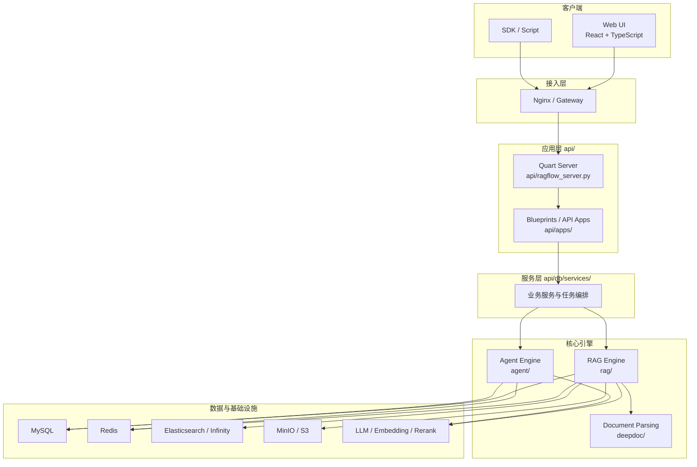

## 概览

RAGFlow 是一个围绕“文档处理、检索增强、对话生成、Agent 编排”构建的全栈系统。  
从运行形态上看，它不是单一脚本，而是由以下几部分协同组成：

- `web/`：前端界面，负责用户交互
- `api/`：Quart Web 服务，负责 HTTP / WebSocket 接入、鉴权和接口编排
- `api/db/services/`：服务层，负责业务规则、状态维护和数据访问协调
- `rag/`：RAG 主引擎，负责解析、分块、向量化、检索、重排和生成
- `deepdoc/`：文档理解与解析组件，尤其是 PDF、DOCX、EPUB、Markdown 等格式处理
- `agent/`：Canvas/DSL 驱动的 Agent 执行引擎
- 外部依赖：MySQL、Redis、Elasticsearch/Infinity、MinIO，以及各类模型服务

可以把它理解成两条主线共同工作：

- 文档主线：文件上传 -> 解析 -> 分块 -> 向量化 -> 入库
- 查询主线：用户提问 -> 检索 -> 重排 -> 组装上下文 -> LLM 生成

## 逻辑架构图

## 关键职责

### 1. 前端与接入

- 前端位于 `web/`，通过 HTTP、SSE、WebSocket 与后端通信
- Nginx 或容器编排层负责反向代理、静态资源分发和统一入口

### 2. API 层

- 入口在 [api/ragflow_server.py](../../api/ragflow_server.py)
- 应用初始化和路由注册在 [api/apps/__init__.py](../../api/apps/__init__.py)
- 负责处理：
  - 鉴权与会话
  - 请求参数校验
  - Blueprint / REST API 暴露
  - 错误响应与超时控制

### 3. 服务层

- 主要位于 [api/db/services/](../../api/db/services/)
- 负责将接口请求转换为可执行的业务流程
- 典型职责：
  - 文档上传与解析任务创建
  - 对话与知识库状态管理
  - 模型配置查询
  - 文件与对象存储协调

### 4. RAG 引擎

- 位于 [rag/](../../rag/)
- 是文档处理和检索增强的主执行层
- 核心能力包括：
  - 选择解析器
  - 文本规范化与分块
  - 向量化
  - 检索与混合召回
  - 重排
  - Prompt 组装与生成

### 5. 文档解析层

- 位于 [deepdoc/parser/](../../deepdoc/parser/)
- 专注于“把各种文件格式变成结构化文本片段”
- 这里的职责不是聊天，而是把原始文件变成后续可检索、可分块、可入库的数据

### 6. Agent 执行层

- 位于 [agent/](../../agent/)
- 负责解释 DSL / Canvas，加载组件，执行节点，处理变量引用、流程控制和事件输出

## 外部依赖的角色

| 组件 | 角色 |
|------|------|
| MySQL | 元数据、业务对象、配置、状态 |
| Redis | 缓存、任务协作、部分执行状态 |
| Elasticsearch / Infinity | 检索索引、向量与文本查询 |
| MinIO / S3 | 原始文件及部分产物存储 |
| LLM / Embedding / Rerank | 语义计算与生成能力 |

## 你应该如何使用这篇文档

这篇文档的目标不是覆盖所有细节，而是先回答三个问题：

1. 这个系统由哪些大块组成？
2. 每一块大致负责什么？
3. 出现问题时，应该先去哪个目录看？

如果你已经知道问题发生在哪条链路，建议继续阅读：

- [002-分层设计.md](./002-分层设计.md)：看层次边界和依赖方向
- [003-数据流.md](./003-数据流.md)：看请求和任务是怎么流动的

## 相关文件

- [api/ragflow_server.py](../../api/ragflow_server.py)
- [api/apps/__init__.py](../../api/apps/__init__.py)
- [api/db/services/](../../api/db/services/)
- [rag/](../../rag/)
- [deepdoc/parser/](../../deepdoc/parser/)
- [agent/](../../agent/)
