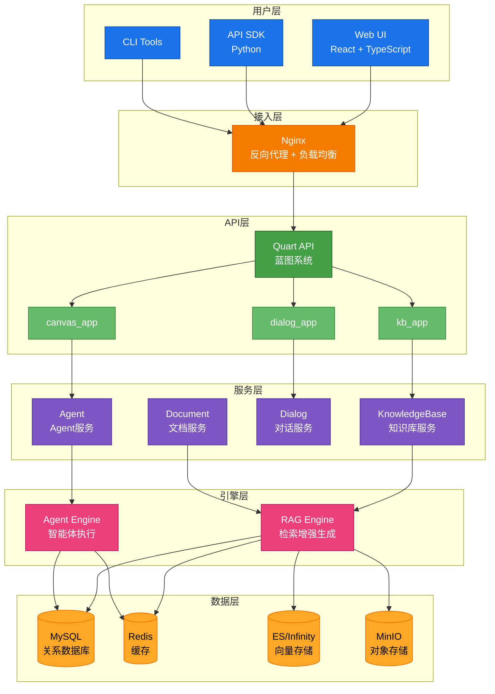
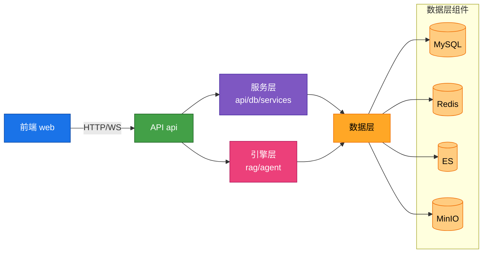

## 描述

RAGFlow 采用分层微服务架构，包含接入层、API 层、服务层、引擎层和数据层。系统基于 Quart 异步框架构建，支持水平扩展和高可用部署。前端使用 React + TypeScript，通过 REST API 和 WebSocket 与后端通信。核心引擎包括 RAG 处理引擎和 Agent 执行引擎，支持多种 LLM 厂商和向量存储。

## 架构图

## 技术栈

| 层级 | 技术 |
|------|------|
| **前端** | React 18+, TypeScript, UmiJS, Ant Design, Zustand |
| **后端** | Python 3.10+, Quart (异步 Flask), Peewee ORM |
| **数据** | MySQL, Redis, Elasticsearch/Infinity, MinIO |
| **LLM** | OpenAI, Anthropic, 通义千问, 文心一言, 智谱 GLM |

## 模块依赖

## 相关文档

- [002-分层设计.md](./002-分层设计.md) - 各层详细设计
- [003-数据流.md](./003-数据流.md) - 数据流转过程
- [02-API层/001-Flask服务器.md](../02-API层/001-Flask服务器.md) - API 层详解
- [03-Agent系统/001-系统架构.md](../03-Agent系统/001-系统架构.md) - Agent 引擎
- [04-RAG引擎/001-文档处理.md](../04-RAG引擎/001-文档处理.md) - RAG 引擎

## 相关文件

- [`api/ragflow_server.py`](../../api/ragflow_server.py) - 服务器入口
- [`api/apps/__init__.py`](../../api/apps/__init__.py) - 蓝图注册
- [`docker/docker-compose.yml`](../../docker/docker-compose.yml) - 服务编排
