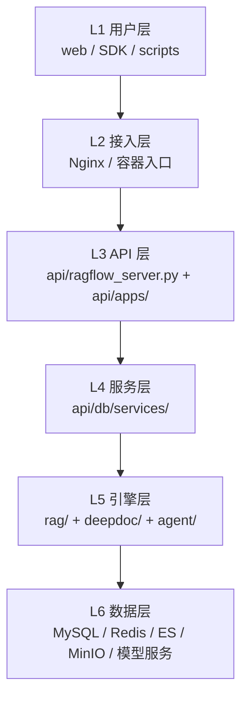
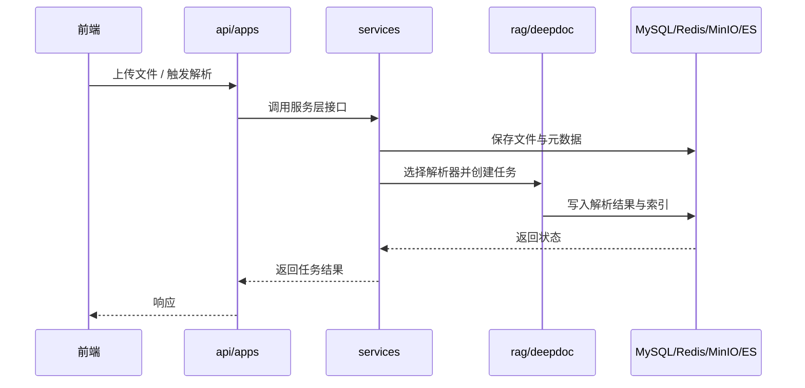

## 目的

整体架构告诉我们“系统由哪些部分组成”，分层设计则回答另一个问题：

“不同目录和模块之间，应该以什么边界协作？”

RAGFlow 的代码并不是严格教科书式的六边形架构，但它已经形成了比较清晰的分层习惯。理解这些边界，有助于你：

- 更快定位问题
- 写文档时不混淆职责
- 加功能时知道代码该落在哪一层

## 分层视图

## 每层职责

### L1 用户层

主要入口：

- [web/](../../web/)
- [sdk/](../../sdk/)
- 脚本、测试、外部调用方

职责：

- 发起请求
- 展示结果
- 收集用户输入

不应承担的职责：

- 直接操作数据库
- 承担复杂业务编排

### L2 接入层

主要形态：

- Nginx
- Docker / Compose 暴露的服务入口

职责：

- 统一入口
- 反向代理
- TLS / 域名 / 端口暴露

### L3 API 层

主要入口：

- [api/ragflow_server.py](../../api/ragflow_server.py)
- [api/apps/](../../api/apps/)

职责：

- 路由与协议适配
- 鉴权、会话、请求上下文
- 把 HTTP / WebSocket 请求转换成服务层调用

不应承担的职责：

- 把完整业务逻辑堆在 route handler 里
- 在接口层直接拼复杂检索或解析算法

### L4 服务层

主要目录：

- [api/db/services/](../../api/db/services/)

职责：

- 面向业务场景组织逻辑
- 协调数据库、对象存储、任务系统、引擎层
- 维持业务对象状态

典型例子：

- 文档上传后创建解析任务
- 重新解析时清理旧结果
- 查询知识库配置并决定后续动作

### L5 引擎层

主要目录：

- [rag/](../../rag/)
- [deepdoc/](../../deepdoc/)
- [agent/](../../agent/)

职责：

- 实现核心能力，而不是暴露接口
- 更关注“怎么做”，少关注“谁来调用”

内部又可以粗分为三块：

| 子系统 | 目录 | 关注点 |
|------|------|------|
| RAG | `rag/` | 检索、分块、向量化、生成 |
| 文档理解 | `deepdoc/` | PDF / DOCX / EPUB / Markdown 等解析 |
| Agent | `agent/` | Canvas、DSL、组件执行、流程控制 |

### L6 数据层

包括：

- MySQL
- Redis
- Elasticsearch / Infinity
- MinIO / S3
- LLM / Embedding / Rerank 模型服务

职责：

- 持久化
- 检索
- 缓存
- 外部计算能力

## 推荐依赖方向

推荐遵守的方向是：

`用户层 -> API 层 -> 服务层 -> 引擎层 / 数据层`

可以接受的常见调用：

- `api/apps/*` 调用 `api/db/services/*`
- `api/db/services/*` 调用 `rag/*`、`deepdoc/*`、`agent/*`
- `rag/*` 调用底层存储与模型抽象

尽量避免的情况：

- `web/` 直接依赖后端实现细节
- `api/apps/*` 直接写大量底层算法
- `deepdoc/` 反向依赖具体的 route handler
- 跨层循环依赖

## 一个典型调用路径

以“文档上传并触发解析”为例：

## 写代码时的落点建议

如果你在新增功能，可以先问自己这个问题：

- 是协议与参数处理？放 `api/apps/`
- 是业务规则与状态编排？放 `api/db/services/`
- 是解析、检索、生成、执行算法？放 `rag/`、`deepdoc/`、`agent/`
- 是底层公共工具？放 `common/` 或对应子系统工具目录

这条判断比“按文件名猜位置”更稳定。

## 对学习者最重要的结论

如果你只记一件事，就记这一句：

`API 层负责接，服务层负责编排，引擎层负责真正干活。`

理解这句之后，很多目录都会自然顺起来。

## 相关文档

- [001-整体架构.md](./001-整体架构.md)
- [003-数据流.md](./003-数据流.md)
- [api/ragflow_server.py](../../api/ragflow_server.py)
- [api/apps/](../../api/apps/)
- [api/db/services/](../../api/db/services/)
- [rag/](../../rag/)
- [deepdoc/](../../deepdoc/)
- [agent/](../../agent/)
