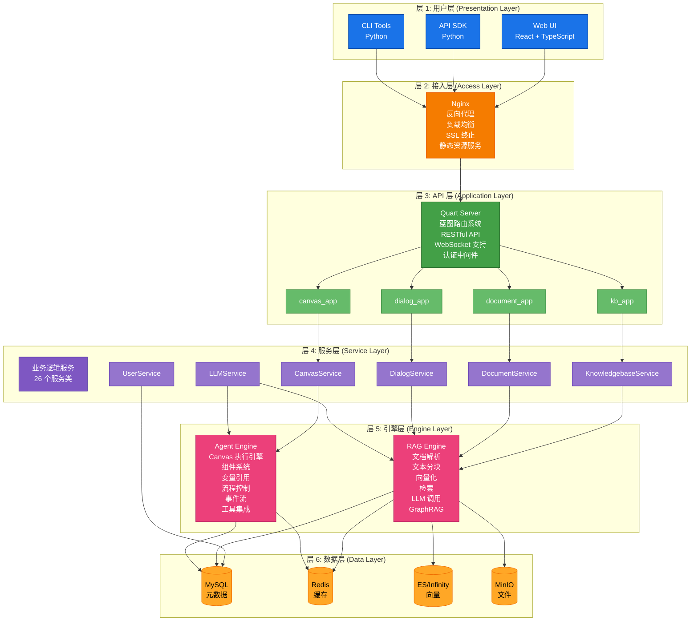
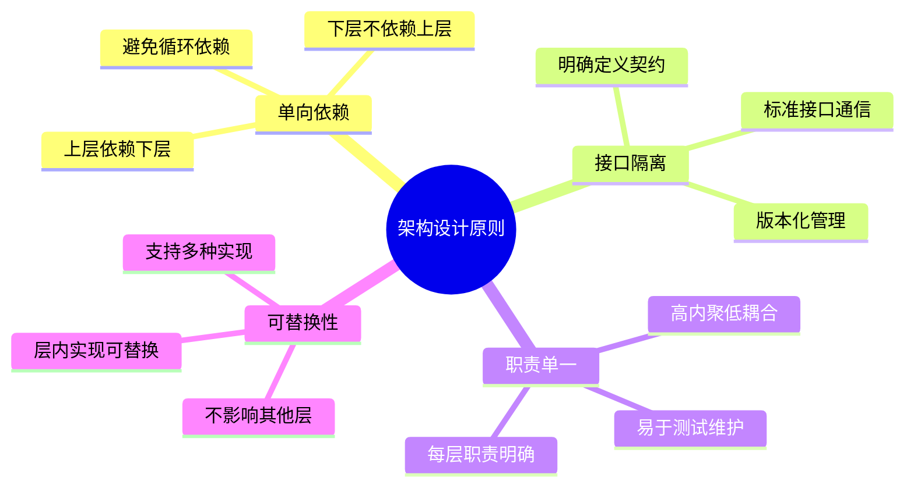

## 描述

RAGFlow 采用经典的五层架构设计：用户层、接入层、API 层、服务层、引擎层和数据层。每层职责明确，通过标准接口通信。用户层提供多端访问；接入层处理负载均衡和安全；API 层实现路由和认证；服务层封装业务逻辑；引擎层提供核心能力；数据层统一管理所有数据存储。

## 分层架构图



## 各层职责

### 层 1: 用户层

提供多种访问方式：

| 组件 | 技术栈 | 职责 |
|------|--------|------|
| Web UI | React + TypeScript | 主要交互界面 |
| API SDK | Python | 编程接口 |
| CLI Tools | Python | 命令行工具 |

### 层 2: 接入层

处理外部流量：

- **Nginx**: 反向代理、负载均衡、SSL 终止
- **静态资源**: 前端文件服务

### 层 3: API 层

实现业务接口：

- **Quart Server**: 异步 Web 框架
- **蓝图系统**: 16 个功能蓝图
- **RESTful API**: 7 个 API 模块
- **认证**: JWT Token 验证

### 层 4: 服务层

封装业务逻辑：

| 服务 | 职责 |
|------|------|
| KnowledgebaseService | 知识库管理 |
| DocumentService | 文档处理 |
| DialogService | 对话管理 |
| CanvasService | 画布管理 |
| LLMService | LLM 配置 |

### 层 5: 引擎层

核心能力实现：

- **RAG Engine**: 文档解析、检索、生成
- **Agent Engine**: 工作流编排、执行

### 层 6: 数据层

统一数据存储：

| 存储 | 用途 |
|------|------|
| MySQL | 元数据、用户数据 |
| Redis | 缓存、会话、队列 |
| Elasticsearch | 向量、全文检索 |
| MinIO | 文件、对象存储 |

## 层间通信

```mermaid
sequenceDiagram
    participant U as 用户层
    participant A as 接入层
    participant API as API 层
    participant S as 服务层
    participant E as 引擎层
    participant D as 数据层

    U->>A: HTTP/WS 请求
    A->>API: 转发请求
    API->>S: 函数调用
    S->>E: 函数调用
    E->>D: 数据操作
    D-->>E: 返回数据
    E-->>S: 返回结果
    S-->>API: 返回结果
    API-->>A: HTTP 响应
    A-->>U: 返回响应

    Note over U,D 请求向下流动<br/>响应向上返回
```

## 设计原则



## 相关文档

- [001-整体架构.md](./001-整体架构.md) - 整体架构概览
- [003-数据流.md](./003-数据流.md) - 数据流转
- [02-API层/001-Flask服务器.md](../02-API层/001-Flask服务器.md) - API 层详解
- [02-API层/004-服务层.md](../02-API层/004-服务层.md) - 服务层详解

## 相关文件

- [`api/ragflow_server.py`](../../api/ragflow_server.py) - API 层入口
- [`api/apps/__init__.py`](../../api/apps/__init__.py) - 蓝图注册
- [`api/db/services/`](../../api/db/services/) - 服务层实现
- [`rag/`](../../rag/) - RAG 引擎
- [`agent/`](../../agent/) - Agent 引擎
- [`deepdoc/parser/`](../../deepdoc/parser/) - 文档解析器
