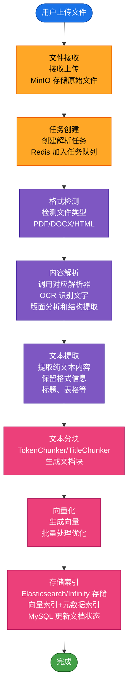
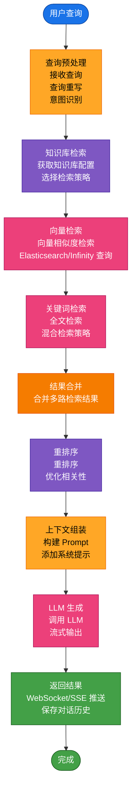
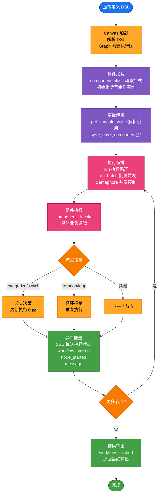
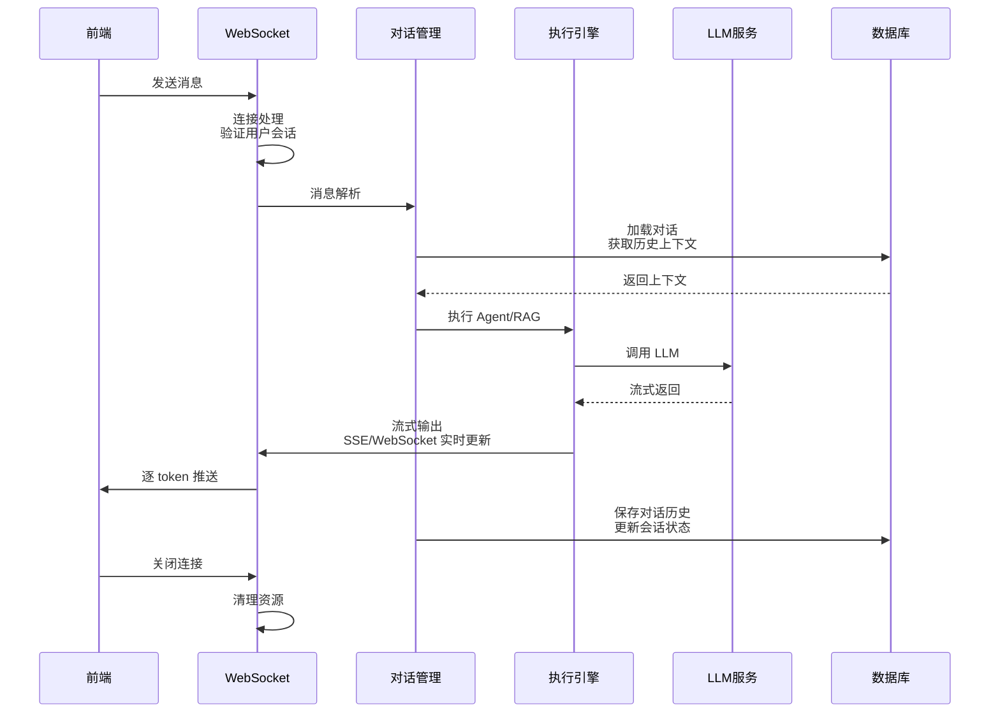
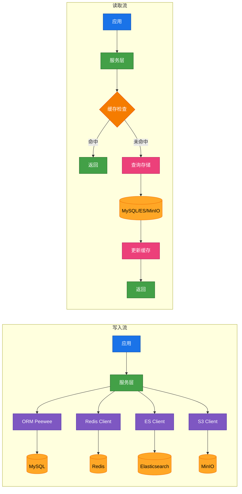
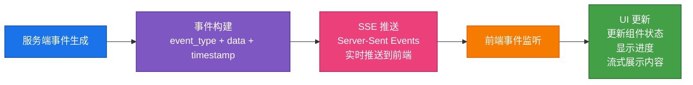

## 描述

RAGFlow 的数据流涵盖文档处理、知识检索、Agent 执行和对话交互四大核心场景。文档从上传到索引经历解析、分块、向量化阶段；检索流程包含查询处理、向量检索、重排序；Agent 执行基于画布定义进行组件编排和数据流转；对话流程维护上下文状态并流式返回结果。

## 文档处理数据流

| 步骤 | 实现文件 |
|------|----------|
| 文件接收 | [`api/apps/file_app.py`](../../api/apps/file_app.py) |
| 任务创建 | [`api/db/services/document_service.py`](../../api/db/services/document_service.py) |
| 格式检测 | [`api/utils/file_utils.py`](../../api/utils/file_utils.py) |
| 内容解析 | [`deepdoc/parser/__init__.py`](../../deepdoc/parser/__init__.py) |
| 文本提取 | [`deepdoc/parser/pdf_parser.py`](../../deepdoc/parser/pdf_parser.py) |
| 文本分块 | [`rag/flow/chunker/__init__.py`](../../rag/flow/chunker/__init__.py) |
| 向量化 | [`rag/llm/embedding.py`](../../rag/llm/embedding.py) |
| 存储索引 | [`rag/nlp/search.py`](../../rag/nlp/search.py) |

## RAG 检索数据流

| 步骤 | 实现文件 |
|------|----------|
| 查询预处理 | [`api/apps/dialog_app.py`](../../api/apps/dialog_app.py) |
| 知识库检索 | [`api/db/services/knowledgebase_service.py`](../../api/db/services/knowledgebase_service.py) |
| 向量检索 | [`rag/nlp/search.py`](../../rag/nlp/search.py) |
| 关键词检索 | [`rag/nlp/search.py`](../../rag/nlp/search.py) |
| 结果合并 | [`rag/nlp/search.py`](../../rag/nlp/search.py) |
| 重排序 | [`rag/llm/rerank.py`](../../rag/llm/rerank.py) |
| 上下文组装 | [`rag/llm/prompts.py`](../../rag/llm/prompts.py) |
| LLM 生成 | [`rag/llm/chat_model.py`](../../rag/llm/chat_model.py) |
| 返回结果 | [`api/apps/dialog_app.py`](../../api/apps/dialog_app.py) |

## Agent 执行数据流

| 步骤 | 实现文件 |
|------|----------|
| Canvas 加载 | [`agent/canvas.py`](../../agent/canvas.py) |
| 组件加载 | [`agent/component/__init__.py`](../../agent/component/__init__.py) |
| 变量解析 | [`agent/component/base.py`](../../agent/component/base.py) |
| 执行编排 | [`agent/canvas.py`](../../agent/canvas.py) |
| 组件执行 | [`agent/component/base.py`](../../agent/component/base.py) |
| 流程控制 | [`agent/component/categorize.py`](../../agent/component/categorize.py)、[`switch.py`](../../agent/component/switch.py)、[`iteration.py`](../../agent/component/iteration.py)、[`loop.py`](../../agent/component/loop.py) |
| 事件推送 | [`agent/canvas.py`](../../agent/canvas.py) |
| 结果输出 | [`agent/canvas.py`](../../agent/canvas.py) |

## 对话交互数据流

| 步骤 | 实现文件 |
|------|----------|
| WebSocket 连接 | [`api/apps/dialog_app.py`](../../api/apps/dialog_app.py) |
| 消息解析 | [`api/apps/dialog_app.py`](../../api/apps/dialog_app.py) |
| 对话管理 | [`api/db/services/dialog_service.py`](../../api/db/services/dialog_service.py) |
| Agent/RAG 执行 | [`agent/canvas.py`](../../agent/canvas.py)、[`rag/app/dialog.py`](../../rag/app/dialog.py) |
| 流式输出 | [`rag/llm/chat_model.py`](../../rag/llm/chat_model.py) |
| 状态保存 | [`api/db/services/conversation_service.py`](../../api/db/services/conversation_service.py) |
| 连接关闭 | [`api/apps/dialog_app.py`](../../api/apps/dialog_app.py) |

## 数据存储流转

| 路径 | 实现文件 |
|------|----------|
| MySQL (ORM) | [`api/db/db_models.py`](../../api/db/db_models.py) |
| Redis (缓存) | [`api/utils/__init__.py`](../../api/utils/__init__.py) |
| Elasticsearch (向量) | [`rag/nlp/search.py`](../../rag/nlp/search.py) |
| MinIO (文件) | [`api/utils/file_utils.py`](../../api/utils/file_utils.py) |

## 事件流

| 步骤 | 实现文件 |
|------|----------|
| 事件构建 | [`agent/canvas.py`](../../agent/canvas.py) |
| SSE 推送 | [`api/apps/dialog_app.py`](../../api/apps/dialog_app.py) |
| 前端监听 | [`web/src/services/chat_service.ts`](../../web/src/services/chat_service.ts) |
| UI 更新 | [`web/src/components/chat/`](../../web/src/components/chat/) |

## 相关文档

- [001-整体架构.md](./001-整体架构.md) - 整体架构
- [002-分层设计.md](./002-分层设计.md) - 分层设计
- [03-Agent系统/001-系统架构.md](../03-Agent系统/001-系统架构.md) - Agent 数据流
- [04-RAG引擎/004-检索机制.md](../04-RAG引擎/004-检索机制.md) - 检索数据流

## 相关文件

- [`api/apps/document_app.py`](../../api/apps/document_app.py) - 文档上传入口
- [`api/apps/dialog_app.py`](../../api/apps/dialog_app.py) - 对话 API
- [`api/db/services/dialog_service.py`](../../api/db/services/dialog_service.py) - 对话服务
- [`agent/canvas.py`](../../agent/canvas.py) - Agent 执行引擎
- [`agent/component/__init__.py`](../../agent/component/__init__.py) - 组件动态加载
- [`deepdoc/parser/`](../../deepdoc/parser/) - 文档解析器
- [`rag/flow/chunker/`](../../rag/flow/chunker/) - 文本分块策略
- [`rag/llm/embedding.py`](../../rag/llm/embedding.py) - 向量化引擎
- [`rag/llm/chat_model.py`](../../rag/llm/chat_model.py) - LLM 调用
- [`rag/llm/rerank.py`](../../rag/llm/rerank.py) - 重排序
- [`rag/nlp/search.py`](../../rag/nlp/search.py) - 检索引擎
