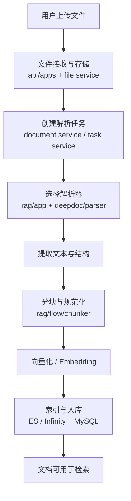
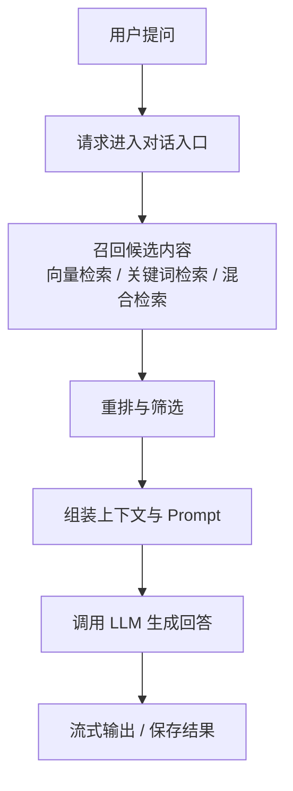
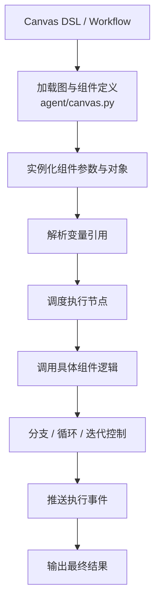
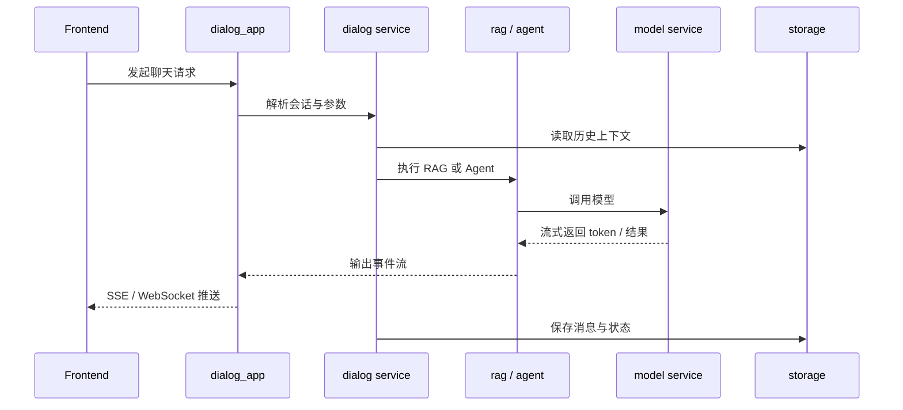

## 目的

这篇文档不再从“模块分层”看系统，而是从“事情是怎么流动的”来看。

对于 RAGFlow，最值得掌握的不是所有类名，而是下面四条主链路：

1. 文档处理流
2. 检索生成流
3. Agent 执行流
4. 对话与事件流

把这四条链路串起来，基本就能理解项目的大部分运行方式。

## 1. 文档处理流

文档处理流关注的是：原始文件如何变成可检索的数据。

关键目录：

- [api/apps/](../../api/apps/)
- [api/db/services/document_service.py](../../api/db/services/document_service.py)
- [api/db/services/task_service.py](../../api/db/services/task_service.py)
- [rag/app/](../../rag/app/)
- [deepdoc/parser/](../../deepdoc/parser/)
- [rag/flow/chunker/](../../rag/flow/chunker/)

这条链路最常见的问题点：

- 文件类型识别错误
- 解析器选择不正确
- PDF / OCR 质量问题
- 分块策略不合理
- 向量化或入库失败

## 2. 检索生成流

检索生成流关注的是：用户问题如何变成最终答案。

关键目录：

- [api/db/services/dialog_service.py](../../api/db/services/dialog_service.py)
- [api/db/services/dialog_service.py](../../api/db/services/dialog_service.py)
- [rag/nlp/search.py](../../rag/nlp/search.py)
- [rag/llm/](../../rag/llm/)

这条链路最常见的问题点：

- 没检索到正确片段
- 检索到了但排序不对
- Prompt 组装不稳定
- LLM 输出质量波动

## 3. Agent 执行流

Agent 执行流关注的是：Canvas/DSL 如何变成真正执行的组件图。

关键目录：

- [agent/canvas.py](../../agent/canvas.py)
- [agent/component/](../../agent/component/)

这条链路最常见的问题点：

- DSL 结构与当前组件 schema 不一致
- 变量解析失败
- 组件输出格式不符合下游预期
- 控制流节点分支判断出错

## 4. 对话与事件流

对话流和检索流有关，但它更关注“连接、状态、流式输出、历史保存”。

关键目录：

- [api/db/services/dialog_service.py](../../api/db/services/dialog_service.py)
- [api/db/services/dialog_service.py](../../api/db/services/dialog_service.py)
- [rag/llm/chat_model.py](../../rag/llm/chat_model.py)
- [web/src/](../../web/src/)

## 从排障角度怎么使用这篇文档

如果你在排查问题，可以先判断问题属于哪一条流：

| 现象 | 优先查看 |
|------|------|
| 文件上传成功但没有可检索内容 | 文档处理流 |
| 检索结果很差或答非所问 | 检索生成流 |
| 工作流节点没有按预期执行 | Agent 执行流 |
| 前端收不到流式结果或历史错乱 | 对话与事件流 |

## 调试顺序建议

推荐的排查顺序：

1. 先确认入口层是否收到请求
2. 再确认服务层是否完成编排
3. 再确认核心引擎是否真正执行
4. 最后确认外部依赖是否返回预期结果

这样比一开始就深挖底层实现更高效。

## 与其他文档的关系

- [001-整体架构.md](./001-整体架构.md)：回答“有哪些部分”
- [002-分层设计.md](./002-分层设计.md)：回答“谁该做什么”
- 本文：回答“请求和任务是怎么跑起来的”

## 相关文件

- [api/db/services/dialog_service.py](../../api/db/services/dialog_service.py)
- [api/db/services/document_service.py](../../api/db/services/document_service.py)
- [api/db/services/task_service.py](../../api/db/services/task_service.py)
- [rag/app/](../../rag/app/)
- [rag/nlp/search.py](../../rag/nlp/search.py)
- [rag/llm/](../../rag/llm/)
- [deepdoc/parser/](../../deepdoc/parser/)
- [agent/canvas.py](../../agent/canvas.py)
