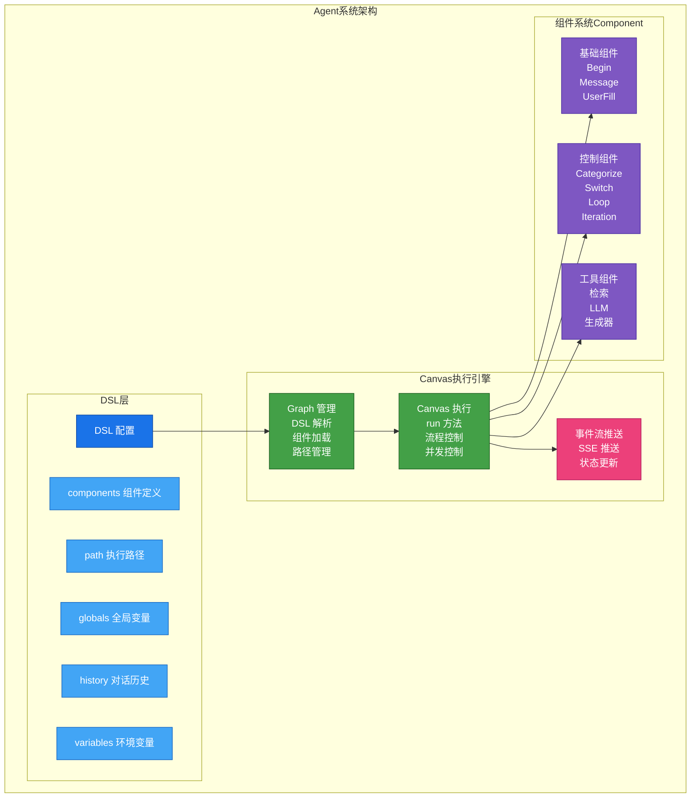
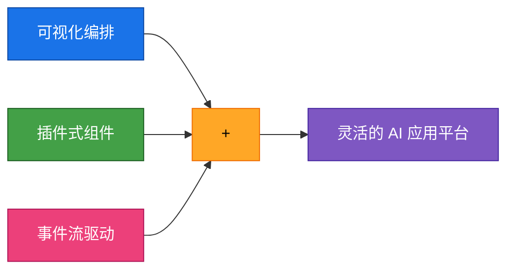
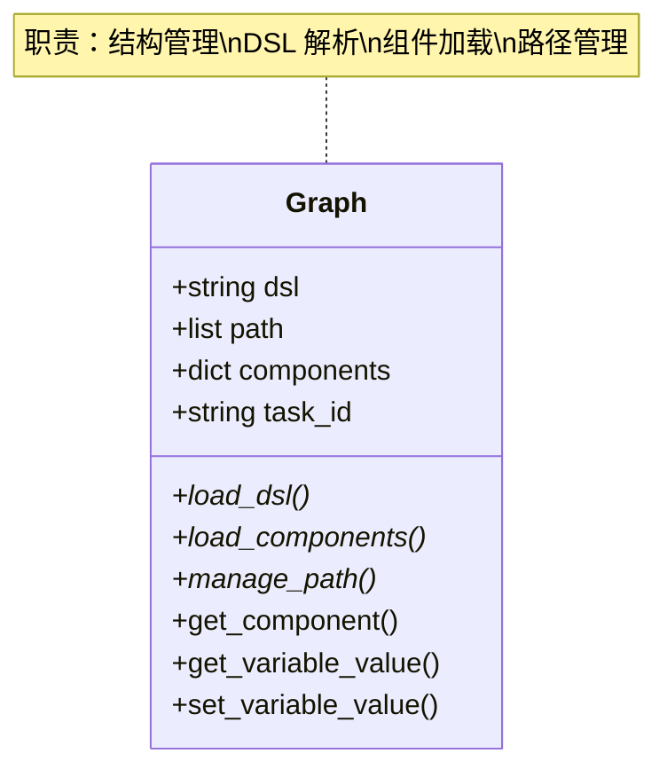
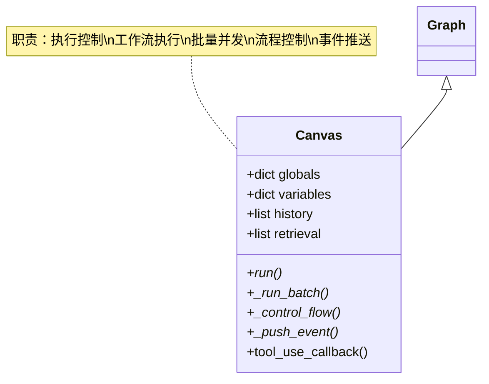
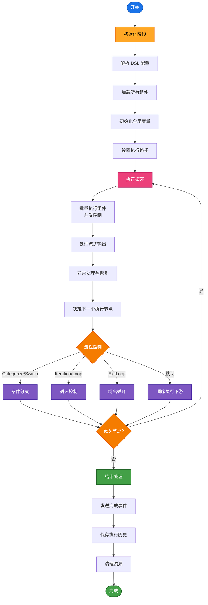
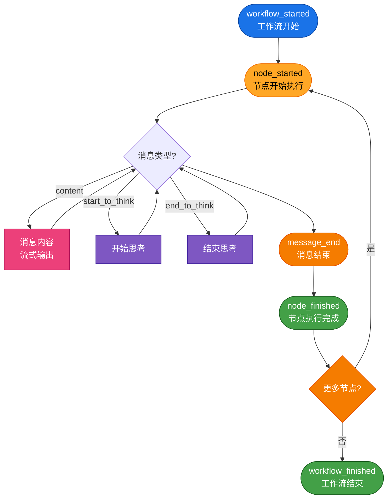
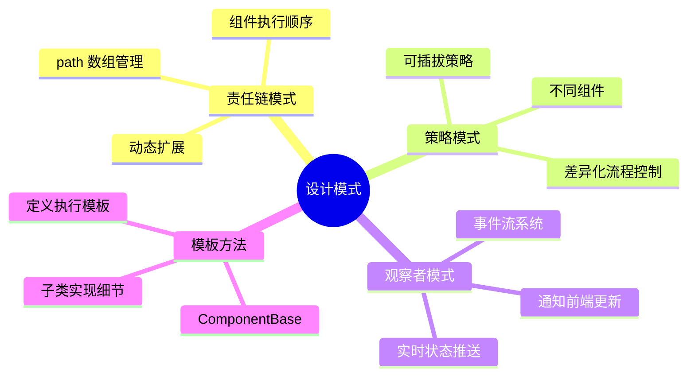
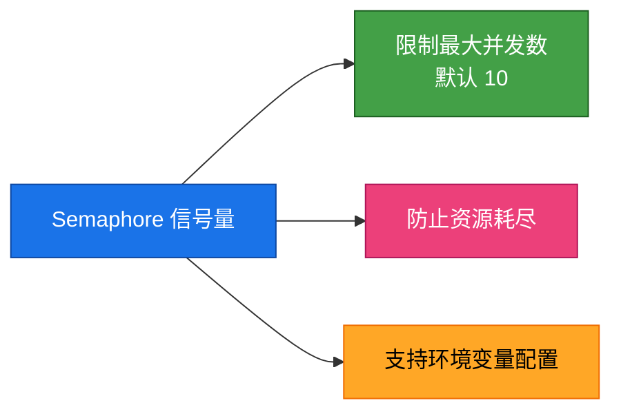
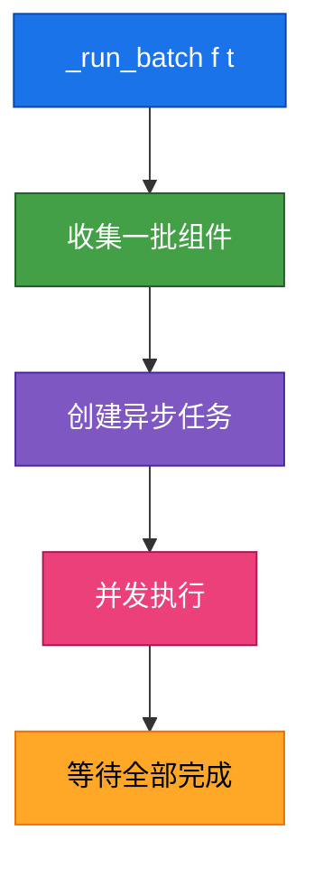

## 描述

RAGFlow Agent 是基于可视化画布的工作流编排系统，采用插件式组件架构。核心引擎在 `agent/canvas.py` 中实现，包含 Canvas 执行引擎和 Graph 结构管理。系统支持 20+ 组件类型、动态组件加载、变量引用、流程控制和事件流推送。

## 系统架构



## 核心设计理念



## Canvas 执行引擎

### Graph (父类)



### Canvas (子类)



## 执行流程



## 事件流系统

### 事件类型



### 事件结构

```json
{
  "event": "node_started",
  "message_id": "uuid",
  "task_id": "uuid",
  "created_at": 1234567890,
  "data": {
    "component_id": "begin",
    "component_name": "开始",
    "component_type": "Begin",
    "thoughts": "思考内容..."
  }
}
```

## 设计模式



## 性能优化

### 并发控制



### 批量执行



### 流式输出


## 与 LangGraph 对比

| 特性 | RAGFlow Agent | LangGraph |
|------|---------------|-----------|
| 设计范式 | 基于类的组件 | 基于函数的节点 |
| 状态管理 | 全局变量 + 组件输出 | 统一 State 对象 |
| 变量引用 | 专用语法 `{@}` | 直接访问 state |
| 可视化 | 内置画布编辑器 | 需要第三方工具 |
| 流式输出 | 原生支持 | 需要手动实现 |

## 相关文档

- [002-组件系统.md](./002-组件系统.md) - 组件详解
- [003-Canvas引擎.md](./003-Canvas引擎.md) - 执行引擎
- [004-变量引用.md](./004-变量引用.md) - 变量系统
- [006-开发指南.md](./006-开发指南.md) - 开发指南

## 相关文件

- [`agent/component/base.py`](../../agent/component/base.py) - 组件基类
- [`agent/component/__init__.py`](../../agent/component/__init__.py) - 组件加载
- [`agent/canvas.py`](../../agent/canvas.py) - 执行引擎
