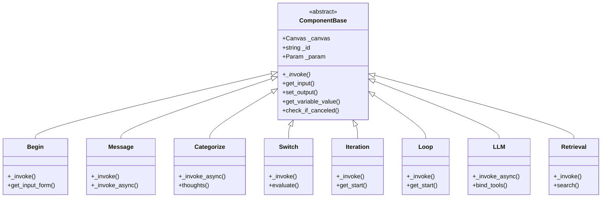
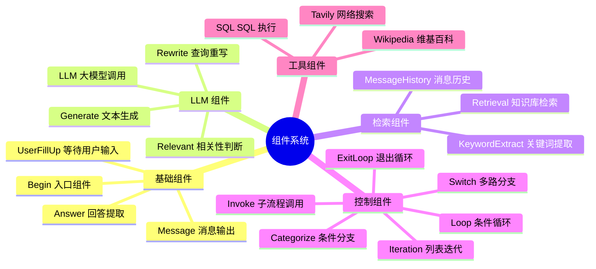
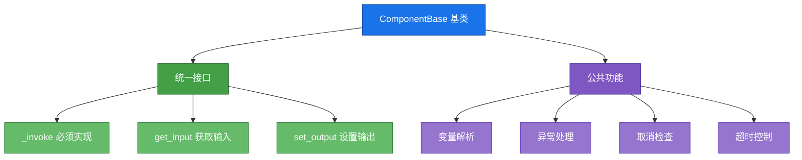
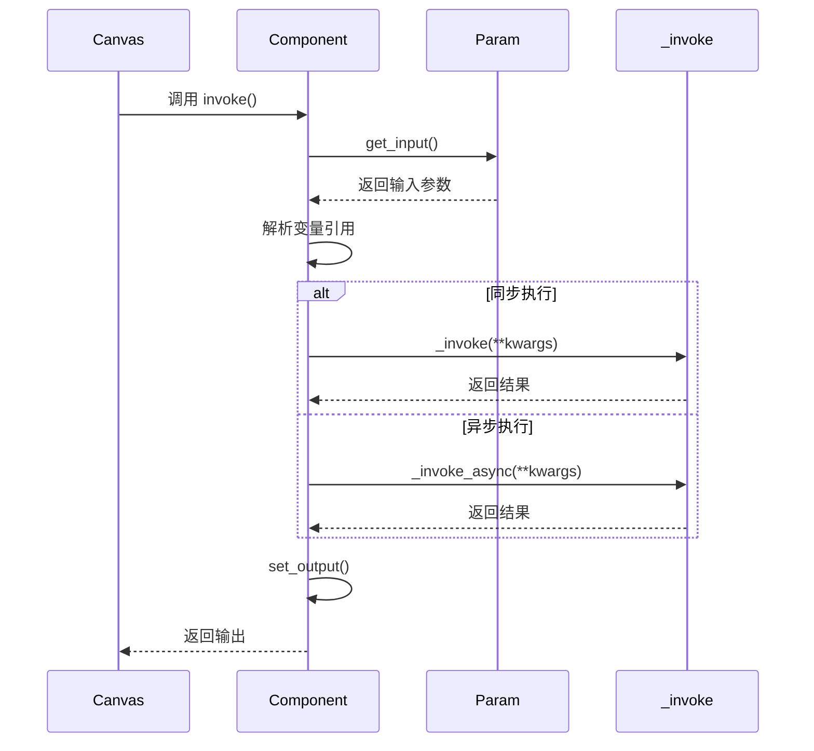
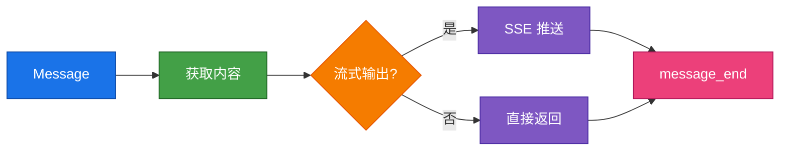
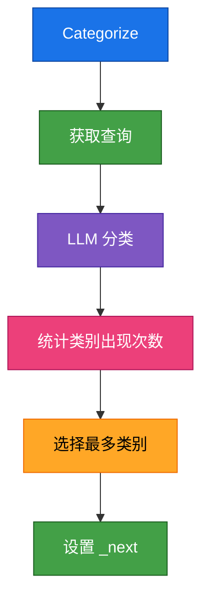
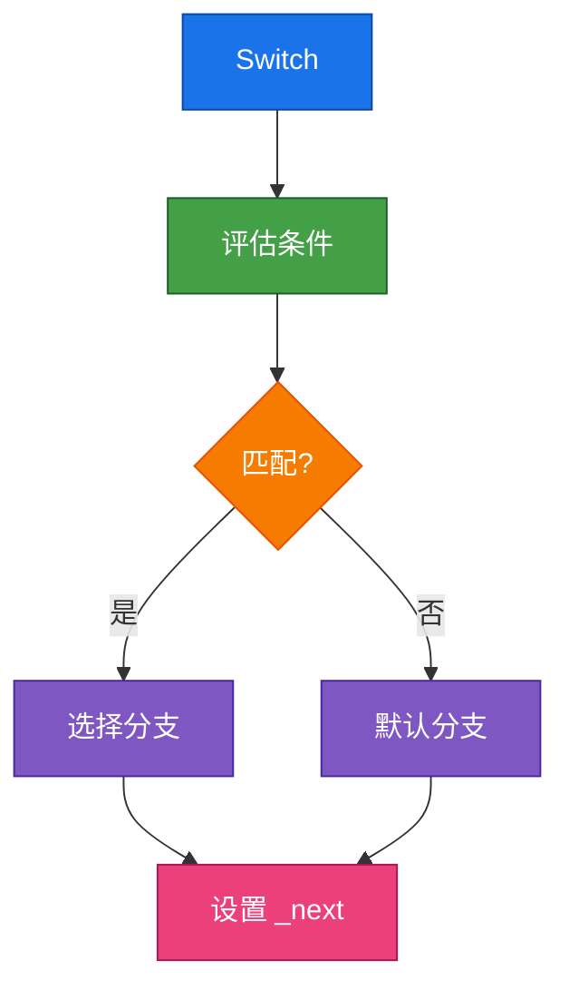
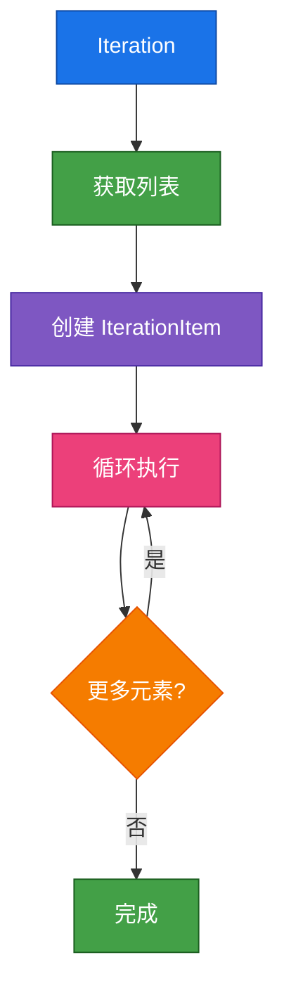

## 描述

RAGFlow Agent 组件系统基于 `ComponentBase` 抽象基类实现，位于 `agent/component/` 目录。包含 20+ 组件类型，分为基础组件、控制组件和工具组件。组件通过 `component_class()` 函数动态加载，支持自动发现和热加载。

## 组件系统架构

## 组件分类

## 组件接口

### ComponentBase 基类

## 组件加载机制

## 组件执行流程

## 基础组件

### Begin 组件

### Message 组件

## 控制组件

### Categorize 组件

### Switch 组件

### Iteration 组件

## 相关文档

- [001-系统架构.md](./001-系统架构.md) - Agent 架构
- [003-Canvas引擎.md](./003-Canvas引擎.md) - 执行引擎
- [004-变量引用.md](./004-变量引用.md) - 变量系统
- [006-开发指南.md](./006-开发指南.md) - 开发指南

## 相关文件

- [`agent/component/base.py`](../../agent/component/base.py) - 组件基类
- [`agent/component/__init__.py`](../../agent/component/__init__.py) - 组件加载
- [`agent/component/categorize.py`](../../agent/component/categorize.py) - 分类组件
- [`agent/component/switch.py`](../../agent/component/switch.py) - 分支组件
