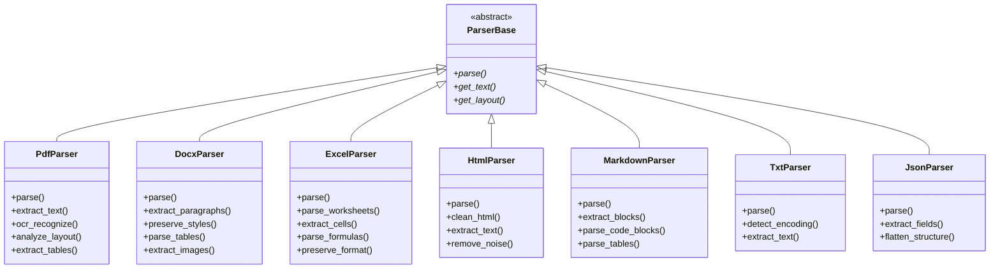
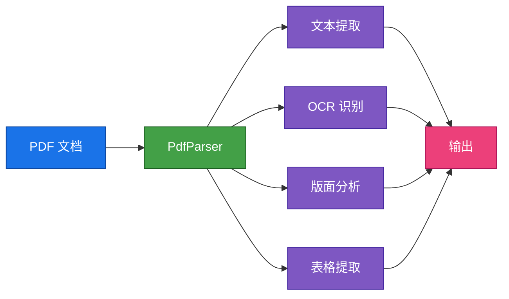
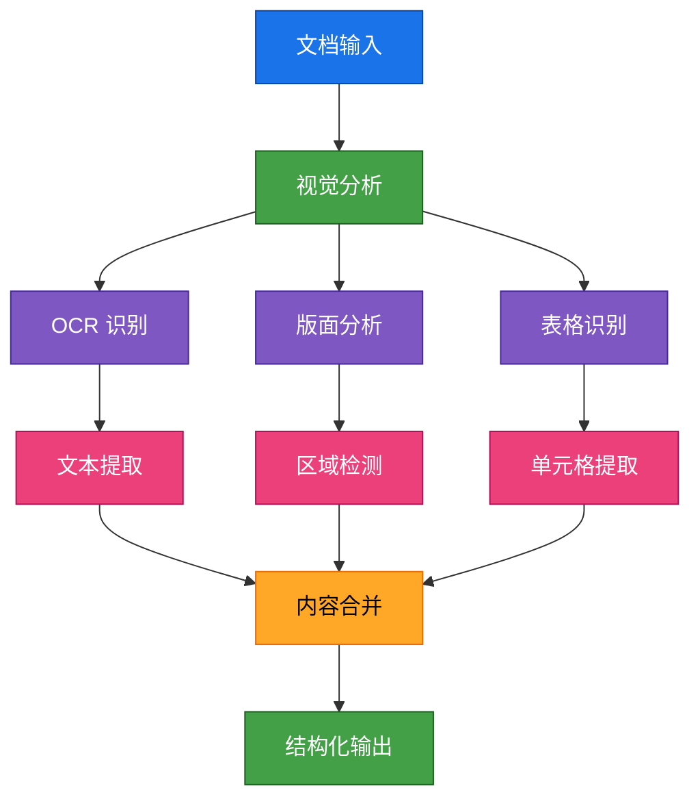
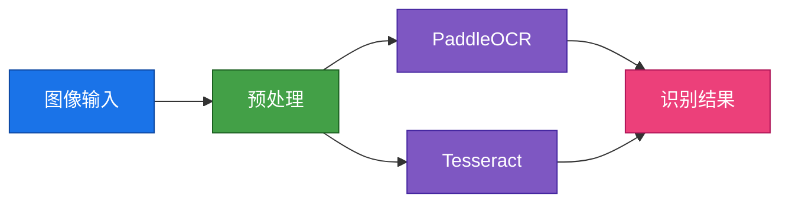
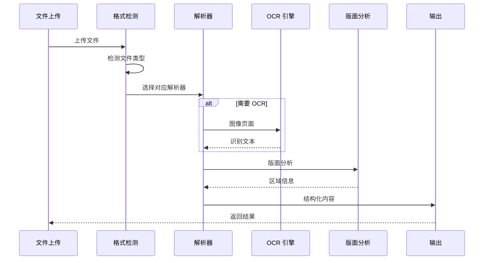

## 描述

RAGFlow 文档处理引擎位于 `deepdoc/parser/` 目录，支持多种文档格式的解析。引擎提供统一的解析器接口，支持 PDF、DOCX、Excel、HTML、Markdown、TXT 等格式。解析器结合 OCR 和版面分析技术，能够提取文本、表格、图片等复杂内容。

## 解析器架构

## 解析器列表

### 1. PdfParser

源文件: [`parser/pdf_parser.py`](../../deepdoc/parser/pdf_parser.py)

| 功能 | 描述 |
|------|------|
| 文本提取 | 提取 PDF 文本内容 |
| OCR 识别 | 图像文字识别 |
| 版面分析 | 区域检测和分类 |
| 表格提取 | 表格结构识别 |

支持特性:
- 多语言 OCR (PaddleOCR, Tesseract)
- 保留文档结构
- 图片和表格提取

### 2. DocxParser

源文件: [`parser/docx_parser.py`](../../deepdoc/parser/docx_parser.py)

| 功能 | 描述 |
|------|------|
| 段落提取 | 提取文档段落 |
| 样式保留 | 保留字体、颜色 |
| 表格解析 | 提取表格数据 |
| 图片提取 | 提取嵌入图片 |

### 3. ExcelParser

源文件: [`parser/excel_parser.py`](../../deepdoc/parser/excel_parser.py)

| 功能 | 描述 |
|------|------|
| 工作表解析 | 解析多个工作表 |
| 单元格提取 | 提取单元格内容 |
| 公式解析 | 解析单元格公式 |
| 格式保留 | 保留数字格式 |

### 4. HtmlParser

源文件: [`parser/html_parser.py`](../../deepdoc/parser/html_parser.py)

| 功能 | 描述 |
|------|------|
| HTML 清洗 | 移除脚本和样式 |
| 文本提取 | 提取正文内容 |
| 结构保留 | 保留标题层级 |
| 链接处理 | 处理相对链接 |

### 5. MarkdownParser

源文件: [`parser/markdown_parser.py`](../../deepdoc/parser/markdown_parser.py)

| 功能 | 描述 |
|------|------|
| 块提取 | 提取代码块、引用块 |
| 表格解析 | 解析 Markdown 表格 |
| 标题解析 | 解析标题层级 |
| 链接处理 | 处理图片和链接 |

### 6. TxtParser

源文件: [`parser/txt_parser.py`](../../deepdoc/parser/txt_parser.py)

| 功能 | 描述 |
|------|------|
| 编码检测 | 自动检测文件编码 |
| 文本提取 | 提取纯文本 |
| 换行处理 | 处理不同换行符 |

### 7. JsonParser

源文件: [`parser/json_parser.py`](../../deepdoc/parser/json_parser.py)

| 功能 | 描述 |
|------|------|
| 字段提取 | 提取指定字段 |
| 结构扁平化 | 嵌套对象扁平化 |
| 数组处理 | 处理数组类型 |

## 版面分析

## OCR 引擎

### OCR 引擎对比

| 特性 | PaddleOCR | Tesseract |
|------|-----------|-----------|
| 多语言支持 | 优秀 | 良好 |
| 中文识别 | 优秀 | 一般 |
| 表格识别 | 支持 | 不支持 |
| 速度 | 快 | 慢 |
| 准确率 | 高 | 中 |

## 处理流程

## 相关文档

- [002-分块策略.md](./002-分块策略.md) - 文本分块
- [003-向量化.md](./003-向量化.md) - 向量生成
- [004-检索机制.md](./004-检索机制.md) - 检索引擎

## 相关文件

- [`deepdoc/parser/__init__.py`](../../deepdoc/parser/__init__.py) - 解析器入口
- [`deepdoc/parser/pdf_parser.py`](../../deepdoc/parser/pdf_parser.py) - PDF 解析
- [`deepdoc/vision/ocr.py`](../../deepdoc/vision/ocr.py) - OCR 引擎
- [`deepdoc/vision/layout.py`](../../deepdoc/vision/layout.py) - 版面分析
