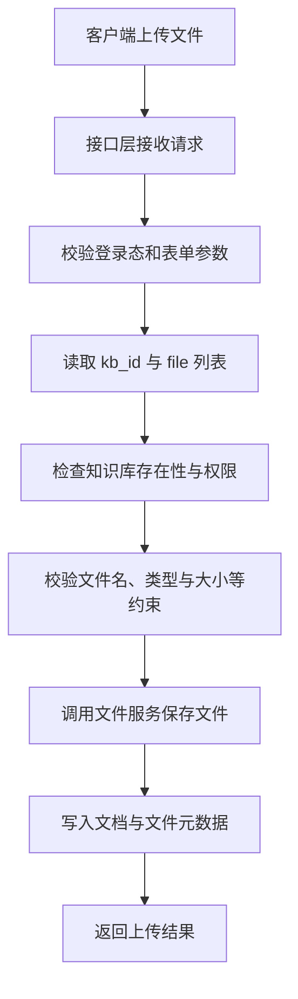

# 上传文件接口

> 路由：`POST /api/v1/document/upload`  
> 入口参考：[api/apps/document_app.py](../../api/apps/document_app.py)

## 这篇文档讲什么

这篇文档只回答一个问题：

`/document/upload` 收到文件后，系统做了哪些最关键的事情？

它不展开所有实现细节，而是帮助你先建立主流程。

## 主流程

## 关键职责拆分

### 1. 接口层

职责：

- 接收 `multipart/form-data`
- 校验 `kb_id`
- 提取上传文件列表
- 校验当前用户是否有权限上传到目标知识库

### 2. 服务层

职责：

- 统一处理文件保存逻辑
- 创建或更新文档记录
- 建立文件与知识库之间的关系

### 3. 存储层

职责：

- 原始文件通常会进入对象存储
- 元数据进入 MySQL

## 你最该关心的几个问题

排查上传问题时，优先看这几个点：

1. 请求参数是否齐全，尤其是 `kb_id`
2. 当前用户是否对目标知识库有权限
3. 文件名、文件大小、文件类型是否触发限制
4. 对象存储是否可写
5. 文档元数据是否成功入库

## 常见排障入口

- [api/apps/document_app.py](../../api/apps/document_app.py)
- [api/db/services/document_service.py](../../api/db/services/document_service.py)
- [api/db/services/file_service.py](../../api/db/services/file_service.py)

## 建议阅读顺序

如果你是第一次看这条链路，建议按下面顺序：

1. 本文
2. [逻辑步骤/001-上传文件接口业务逻辑.md](./逻辑步骤/001-上传文件接口业务逻辑.md)
3. [技术要点/001-上传文件接口技术要点.md](./技术要点/001-上传文件接口技术要点.md)
