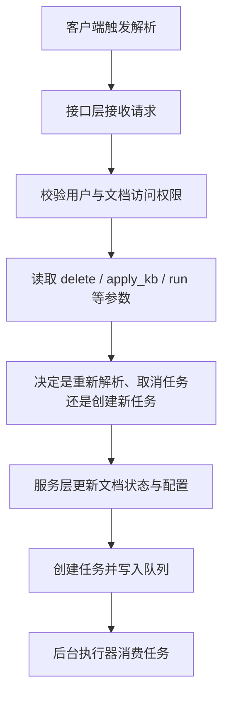

# 文档解析接口

> 路由：`POST /api/v1/document/run`  
> 入口参考：[api/apps/document_app.py](../../api/apps/document_app.py)

## 这篇文档讲什么

这篇文档描述的是“用户点击解析”之后，接口层如何把动作转换成后台任务。

它的重点不是解析算法本身，而是：

- 请求如何进入系统
- 什么时候创建任务
- 什么时候取消任务
- 任务如何进入后续执行链路

## 主流程

## 它在整体链路中的位置

`/document/run` 不是解析器本身，它更像“任务启动器”。

它负责把用户意图变成后端可执行的任务对象，后续真正执行发生在任务执行器中。

## 关键职责

### 1. 参数与权限校验

- 当前用户是否有权限操作文档
- 文档是否可被当前用户访问
- 是否允许重新解析

### 2. 配置处理

- 读取文档当前配置
- 在 `apply_kb=true` 时读取知识库配置
- 用知识库配置覆盖文档中的部分解析字段

### 3. 任务创建

- 为文档创建标准解析任务或特殊任务
- 必要时先清理旧索引和旧解析结果
- 将任务写入执行队列

### 4. 状态更新

- 更新文档的运行状态
- 标记开始解析、取消解析或重试

## 这篇文档不展开的部分

下面这些内容属于下一层文档：

- 标准解析任务到底怎么执行：看 [003-do_handle_task-标准文档解析流程.md](./003-do_handle_task-标准文档解析流程.md)
- 分块逻辑：看 [004-chunker.chunk-文本分块逻辑详解.md](./004-chunker.chunk-文本分块逻辑详解.md)
- 向量化与入库：看 [006-embedding向量嵌入与insert_chunks入库详解.md](./006-embedding向量嵌入与insert_chunks入库详解.md)

## 常见排障入口

- [api/apps/document_app.py](../../api/apps/document_app.py)
- [api/db/services/document_service.py](../../api/db/services/document_service.py)
- [api/db/services/task_service.py](../../api/db/services/task_service.py)
- [rag/svr/task_executor.py](../../rag/svr/task_executor.py)
