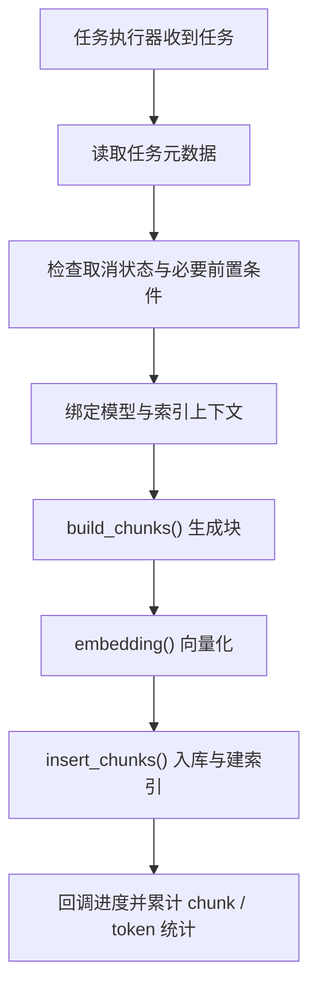

# do_handle_task 标准文档解析流程

> 核心执行入口参考：[rag/svr/task_executor.py](../../rag/svr/task_executor.py)

## 这篇文档讲什么

当任务已经进入后台队列后，真正“干活”的核心函数之一就是 `do_handle_task()`。

这篇文档聚焦标准文档解析路径，不展开 DataFlow、GraphRAG、RAPTOR 等特殊任务。

## 主流程

## 它的职责边界

`do_handle_task()` 的职责是“调度并串起标准解析任务”，而不是把所有细节都写在一个函数里。

它主要做四件事：

1. 准备任务执行上下文
2. 串联标准处理步骤
3. 处理取消、异常和收尾
4. 推进进度回调并累计文档统计信息

## 三个核心步骤

### 1. `build_chunks()`

负责：

- 选择合适的解析器
- 读取文档内容
- 做文本提取、结构化和分块

### 2. `embedding()`

负责：

- 将文本块送入 embedding 模型
- 生成向量表示

### 3. `insert_chunks()`

负责：

- 将 chunk 元数据写入存储
- 将向量与检索字段写入检索引擎

## 为什么这一步很关键

如果你想理解“一个文档为什么最终能被检索到”，这篇文档对应的链路就是核心答案。

上传接口只负责把任务发出来，真正让文档变成知识的是这一步。

需要注意的是：

- `do_handle_task()` 会通过 `progress_callback(...)` 推进任务进度
- `do_handle_task()` 会通过 `DocumentService.increment_chunk_num(...)` 累计 `chunk_num` / `token_num`
- 文档最终 `run` 状态的归并更新，主要由后续的进度同步逻辑完成，而不是只在这个函数里一次性写死

## 常见问题定位

| 现象 | 优先查看 |
|------|------|
| 任务开始了但没有 chunk | `build_chunks()` |
| chunk 有了但检索不到 | `embedding()` / `insert_chunks()` |
| 任务卡住不动 | 取消检查、模型调用、外部依赖 |
| 状态一直不对 | 进度同步与状态归并逻辑 |

## 相关文件

- [rag/svr/task_executor.py](../../rag/svr/task_executor.py)
- [rag/app/](../../rag/app/)
- [rag/flow/chunker/](../../rag/flow/chunker/)
- [deepdoc/parser/](../../deepdoc/parser/)
