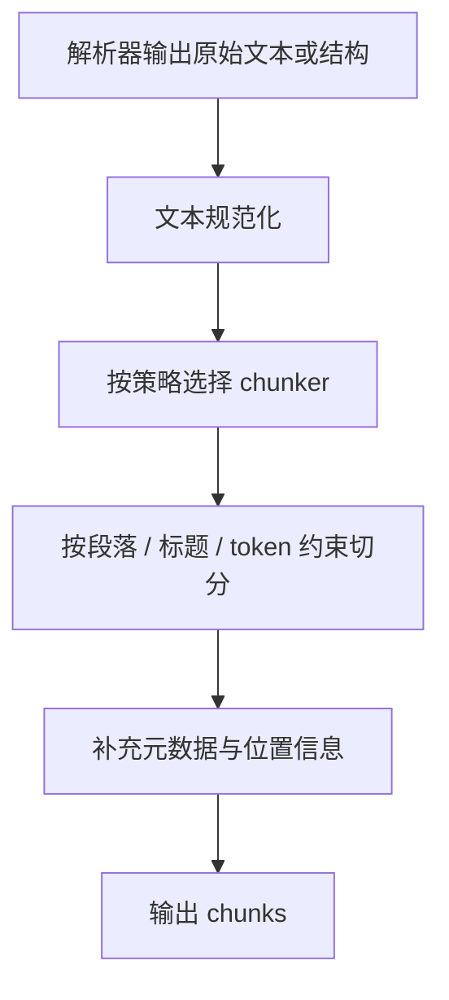

# chunker.chunk 文本分块逻辑详解

## 这篇文档讲什么

这篇文档聚焦一个核心问题：

`解析后的长文本，如何被切成后续可检索、可向量化、可引用的 chunk？`

分块并不是简单按长度切字符串，它决定了后续检索质量和回答质量。

## 主流程

## 分块阶段关注什么

分块逻辑通常会同时考虑：

- token 长度限制
- 标题与段落边界
- 表格、图片、页码等结构信息
- 是否需要上下文衔接

## 为什么它重要

分块太粗：

- 检索召回虽然可能命中，但上下文太杂

分块太细：

- 上下文不完整，回答容易缺信息

所以分块本质上是在做“可检索性”和“上下文完整性”的平衡。

## 你应该把它和什么一起看

分块不是孤立步骤，建议和下面两篇一起看：

- 上游： [005-不同文件类型的切片策略.md](./005-不同文件类型的切片策略.md)
- 下游： [006-embedding向量嵌入与insert_chunks入库详解.md](./006-embedding向量嵌入与insert_chunks入库详解.md)

## 相关目录

- [rag/flow/chunker/](../../rag/flow/chunker/)
- [rag/app/](../../rag/app/)
- [deepdoc/parser/](../../deepdoc/parser/)
