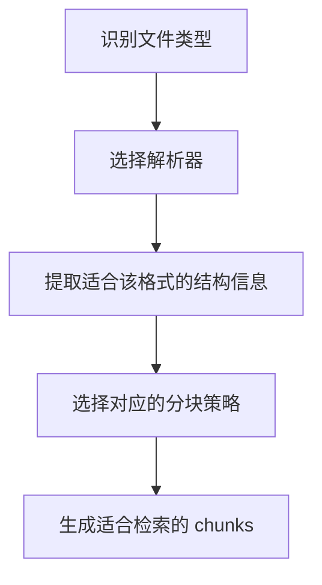

# 不同文件类型的切片策略

## 这篇文档讲什么

不同文件不是同一种“文本来源”，所以不能共用完全相同的切片策略。

这篇文档关注：

- 文件类型如何影响解析器选择
- 文件类型如何影响分块方式
- 哪些格式更依赖结构信息，哪些更接近纯文本

## 一个直观理解

| 文件类型 | 常见特点 | 切片关注点 |
|------|------|------|
| PDF | 版面复杂，可能需要 OCR | 页、段落、标题、表格、图片 |
| DOCX | 结构相对清晰 | 标题层级、段落边界 |
| Markdown / HTML | 自带结构标记 | 标题、列表、代码块 |
| Excel / 表格类 | 单元格结构强 | 行列关系、表头、字段语义 |
| TXT | 结构弱 | 分隔符、长度、段落 |
| EPUB | 按章节组织 | spine 顺序、章节边界 |

## 主流程

## 优化这类文档时应避免什么

不建议在文档里写太多“固定数字 + 固定文件行号 + 固定分支计数”，因为这类信息最容易在重构后过时。

更稳定的写法应该是：

- 先说明“为什么不同格式要分开处理”
- 再说明“每类格式主要关注什么”
- 最后给出源码入口

## 相关目录

- [rag/app/](../../rag/app/)
- [deepdoc/parser/](../../deepdoc/parser/)
- [rag/flow/chunker/](../../rag/flow/chunker/)
