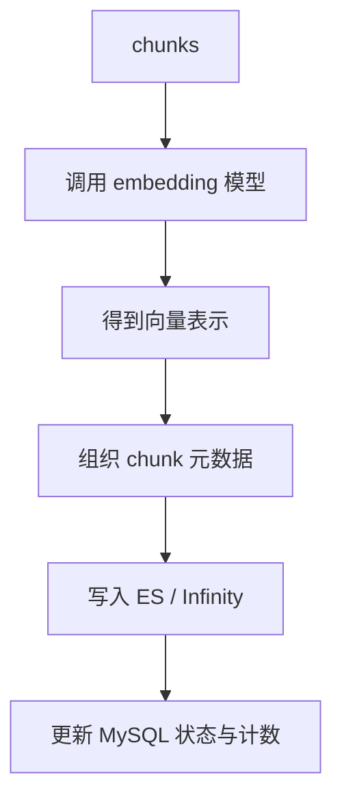

# embedding 向量嵌入与 insert_chunks 入库详解

## 这篇文档讲什么

分块之后，文档还不能被检索。只有完成两件事后，它才真正进入知识系统：

1. 生成向量
2. 把 chunk 和向量写入检索存储

这篇文档讲的就是这两步。

## 主流程

## 两步分别解决什么问题

### Embedding

解决的是：

- 文本如何映射成可做语义相似度计算的向量

### insert_chunks

解决的是：

- 向量和文本块如何进入可检索存储
- 如何保留 chunk 与文档、知识库、页码等关系

## 排障时怎么想

如果“解析成功了但检索不到”，通常优先看这两段：

- embedding 是否成功返回
- 入库是否真正完成

尤其要注意：

- 模型是否可用
- 向量维度是否匹配
- 索引是否已初始化
- 写入后状态是否正确更新

## 相关文件

- [rag/llm/](../../rag/llm/)
- [rag/nlp/search.py](../../rag/nlp/search.py)
- [api/db/services/document_service.py](../../api/db/services/document_service.py)
