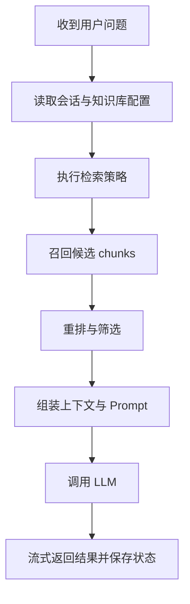

# RAG 检索过程的调用栈和逻辑

## 这篇文档讲什么

这篇文档只关心一个问题：

`用户发起查询后，RAGFlow 如何把问题变成最终答案？`

## 主流程

## 调用链的关注重点

### 1. 入口层

- 请求从对话接口进入
- 接口层负责拿到用户输入、知识库范围和会话信息

### 2. 检索层

- 执行向量检索、关键词检索或混合检索
- 输出候选 chunk 列表

### 3. 排序层

- 对召回结果做进一步筛选和重排

### 4. 生成层

- 根据检索结果构建上下文
- 调用聊天模型输出答案

## 最常见的误区

不要把“检索差”简单归咎为模型差。  
很多问题其实发生在更前面：

- 入库质量差
- chunk 设计不合理
- 召回策略不对
- rerank 没生效

## 相关文件

- [api/apps/dialog_app.py](../../api/apps/dialog_app.py)
- [api/db/services/dialog_service.py](../../api/db/services/dialog_service.py)
- [rag/nlp/search.py](../../rag/nlp/search.py)
- [rag/llm/](../../rag/llm/)
