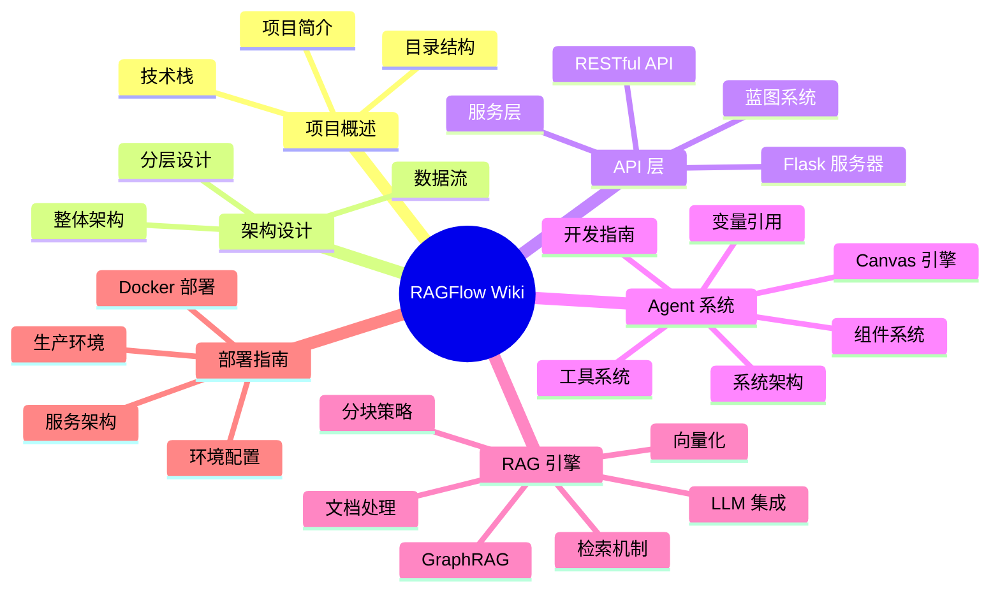

## 描述

RAGFlow 是一个基于深度文档理解的开源 RAG 引擎。本 Wiki 提供系统化的开发文档，涵盖架构设计、API 层、Agent 系统、RAG 引擎和部署指南。

## 文档结构

## 文档导航

### 00-项目概述

- [001-项目简介.md](./00-项目概述/001-项目简介.md) - 项目介绍和核心特性
- [002-技术栈.md](./00-项目概述/002-技术栈.md) - 技术选型说明
- [003-目录结构.md](./00-项目概述/003-目录结构.md) - 项目目录说明

### 01-架构设计

- [001-整体架构.md](./01-架构设计/001-整体架构.md) - 系统架构概览
- [002-分层设计.md](./01-架构设计/002-分层设计.md) - 分层架构详解
- [003-数据流.md](./01-架构设计/003-数据流.md) - 数据流转过程

### 02-API层

- [001-Flask服务器.md](./02-API层/001-Flask服务器.md) - Quart 服务器
- [002-蓝图系统.md](./02-API层/002-蓝图系统.md) - 蓝图自动发现
- [003-RESTful-API.md](./02-API层/003-RESTful-API.md) - RESTful API
- [004-服务层.md](./02-API层/004-服务层.md) - 业务服务层

### 03-Agent系统

- [001-系统架构.md](./03-Agent系统/001-系统架构.md) - Agent 系统架构
- [002-组件系统.md](./03-Agent系统/002-组件系统.md) - 组件系统详解
- [003-Canvas引擎.md](./03-Agent系统/003-Canvas引擎.md) - 执行引擎
- [004-变量引用.md](./03-Agent系统/004-变量引用.md) - 变量引用系统
- [005-工具系统.md](./03-Agent系统/005-工具系统.md) - 工具集成
- [006-开发指南.md](./03-Agent系统/006-开发指南.md) - 组件开发指南

### 04-RAG引擎

- [001-文档处理.md](./04-RAG引擎/001-文档处理.md) - 文档解析
- [002-分块策略.md](./04-RAG引擎/002-分块策略.md) - 文本分块
- [003-向量化.md](./04-RAG引擎/003-向量化.md) - 向量化引擎
- [004-检索机制.md](./04-RAG引擎/004-检索机制.md) - 检索系统
- [005-LLM集成.md](./04-RAG引擎/005-LLM集成.md) - LLM 集成
- [006-GraphRAG.md](./04-RAG引擎/006-GraphRAG.md) - GraphRAG

### 05-部署指南

- [001-Docker部署.md](./05-部署指南/001-Docker部署.md) - Docker 部署
- [002-环境配置.md](./05-部署指南/002-环境配置.md) - 环境配置
- [003-服务架构.md](./05-部署指南/003-服务架构.md) - 服务架构
- [004-生产环境.md](./05-部署指南/004-生产环境.md) - 生产部署

## 快速链接

| 主题 | 链接 |
|------|------|
| 项目简介 | [001-项目简介.md](./00-项目概述/001-项目简介.md) |
| 整体架构 | [001-整体架构.md](./01-架构设计/001-整体架构.md) |
| Agent 系统 | [001-系统架构.md](./03-Agent系统/001-系统架构.md) |
| RAG 引擎 | [001-文档处理.md](./04-RAG引擎/001-文档处理.md) |
| Docker 部署 | [001-Docker部署.md](./05-部署指南/001-Docker部署.md) |

## 贡献指南

欢迎贡献文档改进！

1. 确保文档符合现有风格
2. 使用中文编写
3. 包含代码示例和图表
4. 更新相关文件引用

## 参考资源

- [官网](https://ragflow.io)
- [GitHub](https://github.com/infiniflow/ragflow)
- [用户文档](https://ragflow.io/docs)
